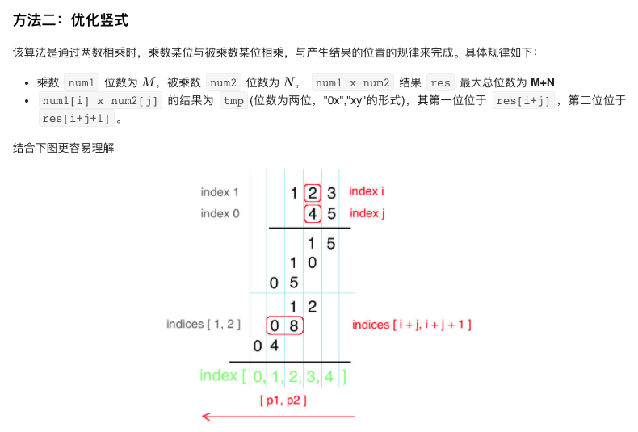

# LeetCode 2nd Round For Reveiwing and Improving

## Plan

- [腾讯tag](https://leetcode-cn.com/leetbook/read/tencent/xxqfy5/)
- [字节tag](https://leetcode-cn.com/explore/interview/card/bytedance/?utm_campaign=bytedance_2020fall_explore&utm_medium=leetcode_leetbook_banner&utm_source=explore&gio_link_id=nP2lpDV9)
- [剑指offer](https://leetcode-cn.com/problemset/lcof/)
- [程序员面试金典](https://leetcode-cn.com/problemset/lcci/)
- reviewing problems solved in the 1st round
- PS: think and do it, but think first.

## 腾讯tag

1. 寻找两个正序数组的中位-hard

  [参考思路：解法三](https://leetcode-cn.com/problems/median-of-two-sorted-arrays/solution/xiang-xi-tong-su-de-si-lu-fen-xi-duo-jie-fa-by-w-2/): 求第k小的数。 

2. 最长回文子串-medium

     中心扩散法和动态规划：`dp[l][r]`表示字符串从l到r这段是否为回文。初始状态，`l=r` 时，此时 `dp[l][r]=true`。状态转移方程，`dp[l][r]=true` 并且`(l-1)`和`(r+1)`两个位置为相同的字符，此时`dp[l-1][r+1]=true`。

3. atoi-medium：注意边界条件的处理，对正负数分情况处理，正数：当转换之后的值比INT_MAX大的时候，返回INT_MAX。负数：先不加符号，此时转化之后的值比INT_MAX大时，返回INT_MIN.

4. 最长公共前缀：巧用substring

5. 3Sum和3Sum Closest: 利用双指针，并且注意重复结果的情况。

6. 有效括号：利用栈的性质。
  
7. [盛最多水的容器](https://leetcode-cn.com/problems/container-with-most-water/solution/container-with-most-water-shuang-zhi-zhen-fa-yi-do/)：利用双指针，向中间移动，比较面积

8. [字符串相乘优化](https://leetcode-cn.com/problems/multiply-strings/solution/you-hua-ban-shu-shi-da-bai-994-by-breezean/)：

9. 反转字符串：双指针，反转字符串中的单词，可以使用java自带的函数strip和trim，以及利用stringbuilder对其进行操作。

10. 除自身之外相乘，考虑两部分，对角线的左上部分和右下部分。

11. 存在重复的元素，可以用set的特性，或者使用hashmap，除此之外还可以通过先对数组进行排序，比较相邻元素是否相等来进行判断。

12. 环形链表：使用快慢指针，面试喜欢考。关于其他链表的面试问题总结，可以参考：[一文搞定常见的链表问题](https://leetcode-cn.com/problems/linked-list-cycle/solution/yi-wen-gao-ding-chang-jian-de-lian-biao-wen-ti-h-2/)，follow up：如果存在环，如何判断环的长度呢？方法是：快慢指针相遇后继续移动，知道第二次相遇。两次相遇的移动次数即为环的长度。

13. [环形链表2](https://leetcode-cn.com/problems/linked-list-cycle-ii/solution/linked-list-cycle-ii-kuai-man-zhi-zhen-shuang-zhi-/): 快慢指针，两次相遇，第一次相遇后慢指针走了a+nb，要想找到环的入口，需要让慢指针再走a步，但是我们不知道a的指是多少，因此需要将快指针重新指向head，slow和fast同时每轮向前走一步，当第二次相遇的时候，这时候同时指向链表环的入口（a指链表头部到链表环入口的距离，b指链表环的长度） 

14. 相交链表：拼接两链表，设定两个指针分别指向两个链表头部，一起向前走直到其中一个到达末端，另一个与末端距离则是两链表的长度差，最终两链表即可同时走到相交点。

15. 回文数：只需要revert一半，然后进行比较，中间的数不用管。

16. 只出现一次的数，使用异或运算。

17. 多数元素：三种思路：hashmap、排序思路、摩尔投票法：因为只需要考虑出现次数大于n/2次，所以多数元素和其他元素互相抵消，抵消到最后至少剩余1个多数元素。

18. 2的幂：使用位运算，判断 `n & (n-1) == 0`， 说明n中只有一个1。

## String

- Day 1: 14/58/387/383/415
  - HashMap可以解决字符串次数方面的问题，例如找到字符串中的第一唯一字符
  - java中`trim()`方法：用于删除字符串的头尾空白符