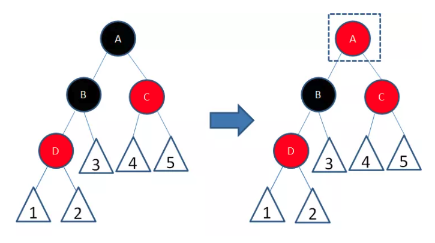
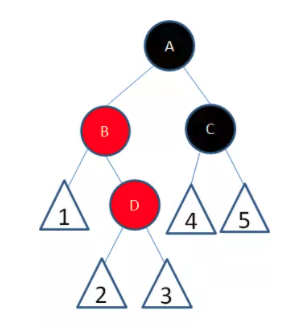
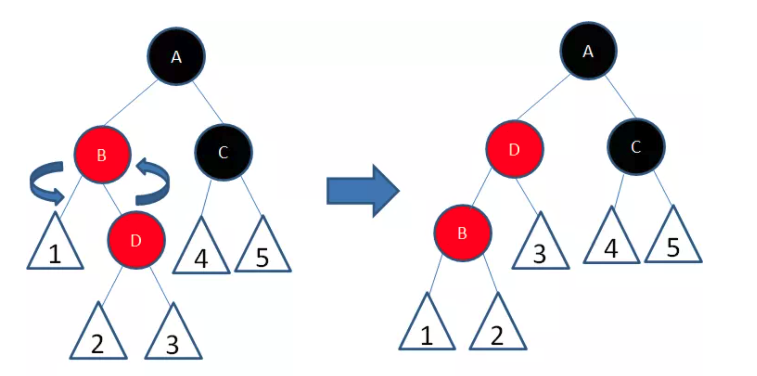
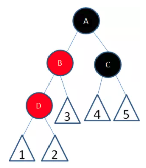
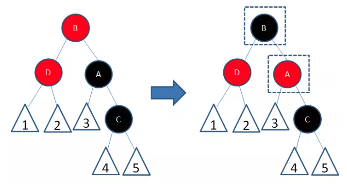

# 红黑树

> [漫画：什么是红黑树](https://mp.weixin.qq.com/s?__biz=MzIxMjE5MTE1Nw==&mid=2653204996&idx=2&sn=ecf932d2db8cb6e4fcb841a2b6a5bfba&chksm=8c99c0debbee49c86dc8e82a2d195389a93e81d8e5ca8af7d4dd2eec5c7fe209038c91444964&mpshare=1&scene=1&srcid=1026679Gd80a1ywuOvLtqgUN&sharer_sharetime=1604466404682&sharer_shareid=94de1277d8499526ff36ea58ffc3303d#rd)

1. 是一种自平衡的二叉查找树，除了符合二叉查找树的基本特性之外，还有遗下附加特性：
   - 结点是红色或黑色。
   - 根结点是黑色。
   - 每个叶子结点都是黑色的空结点（NIL结点）。
   - 每个红色结点的两个子结点都是黑色。(从每个叶子到根的所有路径上不能有两个连续的红色结点)
   - 从任一结点到其每个叶子的所有路径都包含相同数目的黑色结点。

**变色：**为了重新符合红黑树的规则，尝试把红色结点变为黑色，或者把黑色结点变为红色。

下图所表示的是红黑树的一部分（子树），新插入的结点Y是红色结点，它的父亲结点X也是红色的，不符合规则4，因此我们可以把结点X从红色变成黑色

但是，仅仅把一个结点变色，会导致相关路径凭空多出一个黑色结点，这样就打破了规则5。因此，我们需要对其他结点做进一步的调整，后文会详细说明。

**左旋转：**

**逆时针**旋转红黑树的两个结点，使得父结点被自己的右孩子取代，而自己成为自己的左孩子。说起来很怪异，大家看下图：

右旋转：

**顺时针**旋转红黑树的两个结点，使得父结点被自己的左孩子取代，而自己成为自己的右孩子。大家看下图：

插入新结点的时候，可以分成五种不同的局面，每一种局面有不同的调整方法：

1. 局面1:新结点（A）位于树根，没有父节点

这个局面下，直接让新的结点变色未黑色，规则2得到满足。同时，黑色的根结点使得每条路径上的黑色结点都增加了1，所以并没有打破规则5。

2. 局面2：新结点（B）的父节点是黑色

   这种局面，新插入的红色结点B并没有打破红黑树的规则。所以不需要做任何调整。

   

3. 局面3:新结点(D)的父结点和叔叔结点都是红色。

​		这种局面，两个红色结点B和D连续，违反了规则4.因此我们先将结点B变为黑色：

​		这样以来，结点B所在路径凭空多了一个黑色结点，打破了规则5。因此我们让结点A变为红色：

​		这时候，结点A和C又成为了连续的红色结点，我们再让结点C变为黑色：

​		经过上面的调整，这一局部重新复合了红黑树的规则。

4. 局面4：新结点（D）的父结点是红色，叔叔结点是黑色或者没有叔叔，且新结点是父结点的右孩子，父结点（B）是祖父结点的左孩子。

​		我们以结点B为轴，做一次左旋转，使得新结点D成为父结点，原来的父结点B成为D的左孩子：

​		这样以来，进入了局面5:

5. **局面5:** 新结点（D）的父结点是红色，叔叔结点是黑色或者没有叔叔，且新结点是父结点的左孩子，父结点（B）是祖父结点的左孩子。

​		我们以结点A为轴，做一次右旋转，使得结点B成为祖父结点，结点A成为结点B的右孩子：

​		

​		接下来，我们让结点B变为黑色，结点A变为红色：

经过上面的调整，这一局部重新符合了红黑树的规则。

或许有人会问，如果局面4和局面5当中的父结点B是祖父结点A的右孩子该怎么办呢？

很简单，如果局面4中的父结点B是右孩子，则成为了局面5的镜像，原本的右旋操作改为左旋；如果局面5中的父结点B是右孩子，则成为了局面4的镜像，原本的左旋操作改为右旋。

AVL树，更严格平衡的二叉树，要求每个节点的左右子数高度差不超过1；而红黑树则要宽松一些，要求任何一条路径的长度不超过其他路径长度的2倍。

AVl查找效率更高，但平衡调整的成本也有更高。在需要频繁查找时，选用AVL树更合适，在需要频繁插入删除时，选用红黑树更合适。