# CMU Database Systems

> Reference: [CMU Database Group](https://www.youtube.com/channel/UCHnBsf2rH-K7pn09rb3qvkA), [CMU 15-445/645](https://15445.courses.cs.cmu.edu/fall2019/), [《高性能MySQL》](高性能MySQLNotes.md)

## Lecture #01: Relational Model & Relational Algebra

### 1 Database

Definition: an organized collection of inter-related data that models some aspects of the real-world.

Databases are core the component of most computer apps.

DBMS is different from databases.

### 2. Flat File Strawman

Database is stored as comma-separeted value(CSV) files that the DBMS manages.

#### Issues with Flat File

- Data Integrity
- Implementation
- Durability

### 3. Database Management System

a DBMS is software that allows applications to store and analyze information in a database.

allow the definition, creation, querying, updating, and administration of databases.

The logic layer is  which entities and attributes the database has while the physical layer is how those entities and attributes are being stored.

### 4. Relational Model

3 key points:

- Store database in simple data stcutures(relations)
- access data through high-level language.
- physical storage left up to implementation

a data model is a collection of concepts for describing the data in a database. (relational model is an example  of a data model)

a *schema* is  a description of a particular collection of data, using a given data model.

The relational data model defines three concepts:

- **Structure**: the definition of relations and their contents. this is the attributes the relations have and the values that those attributes can hold.
- **Integrity**: ensure the database's contents satisfy constraints.
- **Manipulation**: how to access and modify a database's contents

#### Keys

a primary key uniquely identifies a single tuple. 

a foreign key specifies that an attribute from one relation has to map to a tuple in anotehr relation

### 5. Data Manipulation Language

a language to store and retrieve information from a database.

- **Procedural**: the query specifies the strategy the DBMS should use to find the desired result.
- **Non-Procedura**l: the query specifies only what data is wanted and not how to find it.

### 6. Relational Algebra

a set of fundamental operations to retrieve and manipulate tuples in a relation. (is a procedural language cuz it defines the high level-steps of how to compute a query)

*Select, Projection, Union, Intersection, Difference, Product, Join*

**Join**: Join takes in two relations and outputs a relation that contains all the tuples that are a combination of two tuples where for each attribute that the two relations share, the values for that attrubite of both tuples is the same.

### Conclusion

Databases are ubiquitous

Relational algebra defines the primitives for processing queries on a relational database.

## Lecture #02: Advanced SQL

#### 1 Relational Languages

Relational algebra is based on sets, SQL is based on bags

#### 2 SQL History

Comprised of 3 classes of commands:

- DML: `SELECT, INSERT, UPDATE, DELETE`
- DDL: Schema definition
- DCL: Security, access control

SQL-92 is the minimum that a DBMS has to support

#### 3 Aggregates

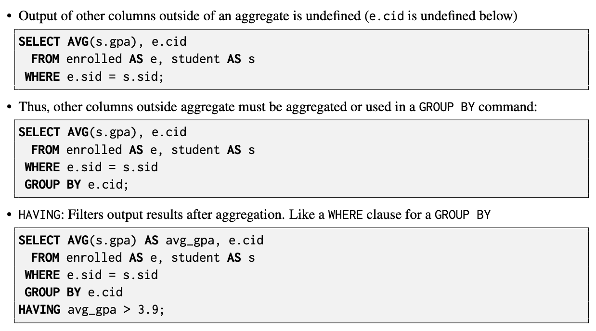

#### 4 String Operations

#### 5 Output Redirection

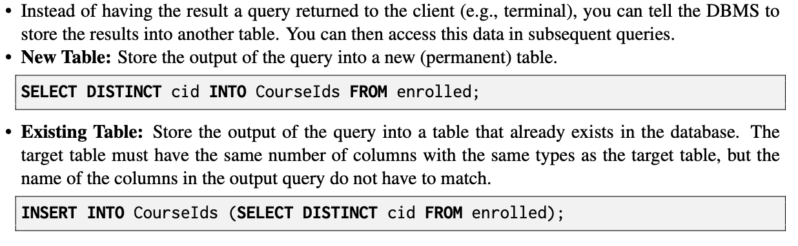

#### 6 Output Control

Order By: impose a sort on tuples

LIMIT: restrict the number of result tuples

#### 7 Nested Queries

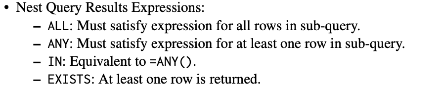

#### 8 Window Functions

- **Functions**: can be any of the aggregation functions that we discussed above. can also be a special window functions:
  - `ROW_NUMBER`: the number of the current row
  - `RANK`: the order position of the current row
- **Grouping**: The `OVER` clause specifies how to group together tuples when computing the window function. Use `PARTITION` BY to specify group.
- **Important**: The DBMS computes `RANK` after the window function sorting, whereas it computes `ROW NUMBER`before the sorting.

#### 9 [Common Table Expression](https://sqlite.org/lang_with.html)

Common Table Expressions (CTEs) are an alternative to windows or nested queries to writing more complex queries. One can think of a CTE like a temporary table for just one query.

## Lecture #03 Database Storage (Part I)

### 1. Storage

File storage page layout tuple layout

1. foucs on a disk-oriented DBMS that primary storage location of the databses is on non-volatile disk
2. **Volatile Devices:** 
   - Volatile means that if you pull the power from the machine, then the data is lost. 
   - Volatile storage supports fast random access with byte-addressable locations. This means that the program can jump to any byte address and get the data that is there. 
   - For our purposes, we will always refer to this storage class as “memory”
3. **Non-Volatile Devices:**
   - Non-volatile means that the storage device does not need to be provided continuous power in order for the device to retain the bits that it is storing. 
   - It is also block/page addressable. This means that in order to read a value at a particular offset, the program first has to load the 4 KB page into memory that holds the value the program wants to read. 
   - Non-volatile storage is traditionally better at sequential access (reading multiple chunks of data at the same time). 
   - We will refer to this as “disk”. We will not make a (major) distinction between solid-state storage (SSD) or spinning hard drives (HDD).

### 2. Disk-Oriented DBMS Overview

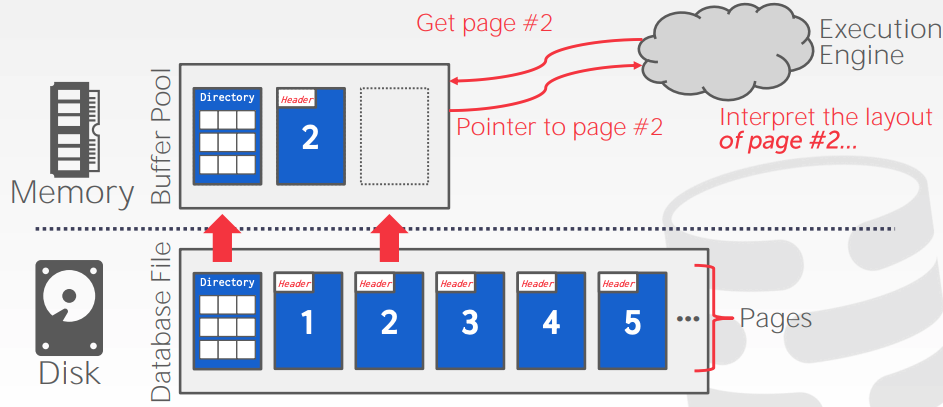

### 3. DBMS vs. OS

High-level design goal is like virtual memory, where there us a large addres space and a place for the OS to bring in pages from disk.

We do not advise using `mmap` in a DBMS for correctness and performance reasons. Even though the system will have functionalities that seem like something the OS can provide, Having the DBMS implement these procedures itself gives it better control and performance.

### 4. File Storage

a DBMS stores a database as files on disk.

The OS does not know anything about the contents of these files. Only the DBMS knows how to decipher their contents, since it is encoded in a way specific to the DBMS.

The DBMS’s `storage manager` is responsible for managing a database’s files. It represents the files as a collection of pages. It also keeps track of what data has been read and written to pages, as well how much free space there is in the pages

### 5. Database pages 

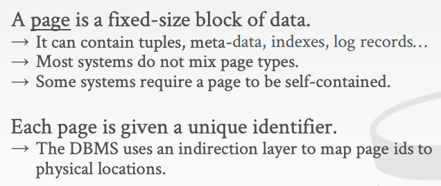

Most DBMSs have an indirection layer that maps a page id to a file path and offset.

There are three concepts of pages in DBMS: 

1. Hardware page (usually 4 KB). 
2. OS page (4 KB). 
3. Database page (1-16 KB).

### 6. Database Heap

A heap file is an unordered collection of pages where tuples are stored in random order.

The DBMS can locate a page on disk given a page id by using a linked list of pages or a page directory. 

- **Linked List**: Header page holds pointers to to a list of free pages and a list of data pages. However, if the DBMS is looking for a specific page, it has to do a sequential scan on the data page list until it finds the page it is looking for. 
- **Page Directory**: DBMS maintains special pages that track locations of data pages along with the amount of free space on each page.

### 7. Page Layout

Every page includes a header that records meta-data about the page’s contents: 

- Page size. 
- Checksum. 
- DBMS version. 
- Transaction visibility. 
- Some systems require pages to be self-contained (e.g oracle)

2 main approaches laying out data in pages:

1. **Slotted-pages**: pages maps slots to offsets
   - Most common approach used in DBMSs today. 
   - Header keeps track of the number of used slots and the offset of the starting location of last used slot and a slot array, which keeps track of the location of the start of each tuple. 
   - To add a tuple, the slot array will grow from the beginning to the end, and the data of the tuples will grow from end to the beginning. The page is considered full when the slot array and the tuple data meet.
2. **Log-structured**:  Instead of storing tuples, the DBMS only stores log records.
   - Stores records to file of how the database was modified (insert, update, deletes). 
   - To read a record, the DBMS scans the log file backwards and “recreates” the tuple. 
   - Fast writes, potentially slow reads. 
   - Works well on append-only storage because the DBMS cannot go back and update the data. 
   - To avoid long reads the DBMS can have indexes to allow it to jump to specific locations in the log. It can also periodically compact the log (if it had a tuple and then made an update to it, it could compact it down to just inserting the updated tuple). The issue with compaction is the DBMS ends up with write amplification (it re-writs the same data over and over again).

### 8. Tuple Layout

A tuple is essentially a sequence of bytes. It is DBMS’s job to interpret those bytes into attribute types and values. 

**Tuple Header**: Contains meta-data about the tuple. 

- Visibility information for the DBMS’s concurrency control protocol (i.e., information about which transaction created/modified that tuple). 
- Bit Map for NULL values. 
- Note that the DBMS does not need to store meta-data about the schema of the database here. 

**Tuple Data**: Actual data for attributes. 

- Attributes are typically stored in the order that you specify them when you create the table. 
- Most DBMSs do not allow a tuple to exceed the size of a page.

**Unique Identifier**: 

- Each tuple in the database is assigned a unique identifier. 
- Most common: page id + (offset or slot). 
- An application cannot rely on these ids to mean anything.

**Denormalized Tuple Data**: If two tables are related, the DBMS can “pre-join” them, so the tables end up on the same page. This makes reads faster since the DBMS only has to load in one page rather than two separate pages, but it makes updates more expensive since the DBMS needs more space for each tuple.

## Lecture #04: Database Storage (Part II)

> [存储模型和数据布局](https://blog.csdn.net/u013007900/article/details/78908526)

### 1. Data Representation

Tuple's data is essentially just bytes arrays. 取决于DBMS怎么interpret他们去derive属性值。

有四种主要的类型：integers, variable precision numbers, fixed point precision numbers, variable length values, and dates/times;

- **Integers**
  - use C/C++ types as specified by the IEEE-754 standard. these values are fixed length.
  - exampels: `INTEGER,BIGINT,SMALLINT,TINYINT`
- **Variable Precision Numbers**
  - variable-precision numeric type that uses C/C++ types as specified by the IEEE-754 standard. these values are fixed length.
  - Variable-precision numbers are faster to compute than arbitrary precision numbers because the CPU can execute instructions on them directly.
  - examples: `FLOAT,REAL`
- **Fixed Point Precision Numbers**
  -  numeric data types with arbitrary precision and scale. They are typically stored in exact, variable-length binary representation with additional meta-data that will tell the system things like where the decimal should be
  - These data types are used when rounding errors are unacceptable, but the DBMS pays a performance penalty to get this accuracy.
  - Examples: `NUMERIC, DECIMAL`
- **Variable Length Data**
  - An array of bytes of arbitrary length. 
  - Has a header that keeps track of the length of the string to make it easy to jump to the next value. 
  - Most DBMSs do not allow a tuple to exceed the size of a single page, so they solve this issue by writing the value on an overflow page and have the tuple contain a reference to that page. 
  - Some systems will let you store these large values in an external file, and then the tuple will contain a pointer to that file. For example, if our database is storing photo information, we can store the photos in the external files rather than having them take up large amounts of space in the DBMS. One downside of this is that the DBMS cannot manipulate the contents of this file.
  - Examples: `VARCHAR,VARBINARY,TEXT,BLOB`
- **Dates and Times**
  - Usually, these are represented as the number of (micro/milli)seconds since the unix epoch. 
  - Example: `TIME, DATE, TIMESTAMP.`

### 2. Workloads

- **OLTP: On-Line Transaction Processing**
  - Fast, short running operations
  - Queries operate on single entity at a time
  - More writes than reads.
  - Repetitive operations
  - Usually the kind of application that people build first
  - Example: User invocations of Amazon. They can add things to their cart, they can make purchases, but the actions only affect their account.
- **OLAP: On-Line Analytical Processing**
  - Long running, more complex queries
  - Reads large portions of the database
  - Exploratory queries
  - Deriving new data from data collected on the OLTP side
  - Example: Compute the five most bought items over a one month period for these geographical locations.

### 3. Storage Models

- **N-Ary Storage Model(NSM)**

  - row store, 适合OLTP
  - 优点：
    - 快速插入，更新和删除
    - 对查询整个tuple很友好
  - 缺点：
    - Not good for scanning large portions of the table and/or a subset of the attributes. This is because it pollutes the buffer pool by fetching data that is not needed for processing the query.
  - 组织方式：
    - **Heap-Organized Tables**: Tuples are stored in blocks called a heap, and the heap does not necessarily define an order. 
    - **Index-Organized Tables**: Tuples are stored in the primary key index itself, but different from a clustered index.

- **Decomposition Storage Model(DSM)**

  - column store, 适合OLAP

  - 优点：

    - Reduces the amount of wasted work during query execution because the DBMS only reads the data that it needs for that query. 
    - Enables better compression because all of the values for the same attribute are stored contiguously

  - 缺点：

    - Slow for point queries, inserts, updates, and deletes because of tuple splitting/stitching.

  - 组织方式：

    - **Fixed-length offsets:** Start by assuming the attributes are all fixed-length. Then when the system wants the attribute for a specific tuple, it knows how to jump to that spot in the file. To accommodate the variable-length fields, the system can pad them so that they are all the same length, or you could use a dictionary that takes a fixed-size integer and maps the integer to the value. 

    

    - **Embedded Tuple Ids:** For every attribute in the columns, store the tuple id with it. The system would also need extra information to tell it how to jump to every attribute that has that id.

    

## Lecture #05: Buffer Pools

### 目标

主要是解决的问题是：DBMS如何管理它的内存使用以及让其数据在磁盘之间的来回转移，主要从以下两个方面来体现：

- 空间控制：在磁盘哪个位置写入page，能够使得对一起使用的page能够尽量保证他们在磁盘的位置也是靠近的
- 时间控制：什么时候读取page进内存以及什么是hi将page写进磁盘，能够使得对磁盘的读写次数尽可能少。

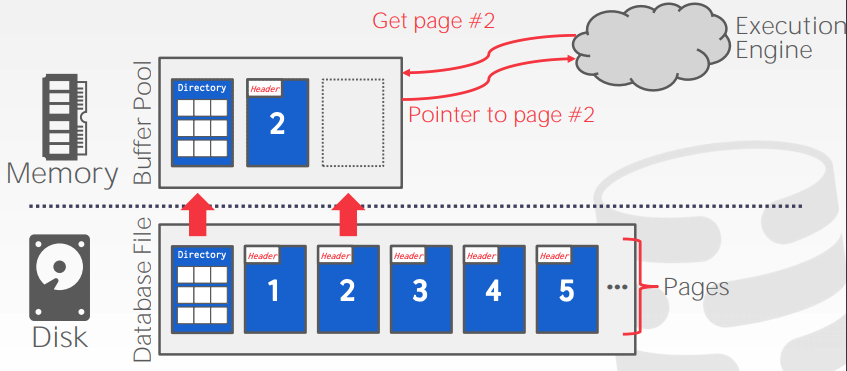

### Buffer Pool Manager

首先看一下缓存池的组织结构。在内存的区域空间被分成一系列固定尺寸的page的数组，每个数组参数被称为一帧。每当DBMS请求一个page的时候，缓存存储会从disk里面复制一个page进入一个fram当中，如图所示：

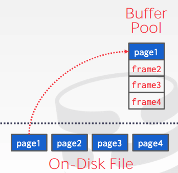

缓存池除了frame之外，还存有page的meta-data，主要通过page-table来管理维护。page-table原理上是一个hashtable来追踪当前在内存里的pages，除此之外，对于每个page来说，还需要有一些额外的变量来维护其他信息，如dirty flag（当前page从读入之后是否被修改过），Pin/refrence counter（当前page是不是正在被使用/被使用过多少次）等等。如下图所示：

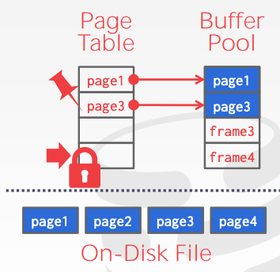

再介绍缓存池管理方法之前，需要区分一下两个概念：

- locks：

  - 保护数据库的逻辑内容不被其他传输干扰
  - 在整个传输持续期间都起作用
  - 可以回退这个操作

- latches：

  - 保护DBMS的关键部分不被其他线程干扰
  - 整个操作期间保持
  - 不需要可以回退操作

  在操作系统里面我们常用的锁（mutex）其实是这里的第二个概念，更多的是关注不同线程在同一个区域共同操作的时候引起的互相干扰，数据库里的锁是第一个概念，需要实现的功能更加复杂一点，在底层也是通过latches来实现的。

  接下来看看page directory和page table的区别：

  - page directory: 通过 page ids 能够定位 page 在数据库文件中的位置（所有的修改都需要写入到 disk 里面，使得机器断电/重启后还能够使用）
  - page table：通过 page ids 能够找到在缓存池里面的 page 对应的 frame 的位置（不需要长期保存，所以不需要保持在 disk 里面）

  关于内存分配策略，有两种思路：

  - *Global Policies* （全局策略）：做决定的时候考虑所有现存的传输记录（transaction）

  - *Local Policies* （局部策略）：分配 frame 只关注当前某个传输记录，不需要考虑其他记录，但是同样需要可以支持 pages 在不同传输之间能工共享。

  接下来讲一下缓存池的几种优化方法。

#### Multiple Buffer Pools

首先可以考虑使用多个缓存池，目前大部分商用的DBMS在使用的时候都不止有一个缓存池，可以根据不同分类来使用多个缓存池，比如：每个table使用一个缓存池/每个数据库使用一个缓存池或者每个 page 类型（tuple, index）使用一个缓存池。这样做的好处有：可以提高某些操作的运行速度，同时可以减少 latch 的使用提升效率（一个传输在修改 page-table 的时候，另一个传输操作可以同时访问另一个缓存池的 page-table 等等）。

有两种方法可以来维护多个缓存池，分别是：

- object id：可以在每个传输记录里面额外加一个 object id 来以此将其映射到某个缓存池中
- Hashing：可以直接通过哈希表的方式将 page id 映射到某个缓存池上。

#### Pre-fetching

the DBMS can also optimize by pre fetching pages based on the query plan. Commonly done when accessing pages sequentially.

我们之所以能够这么做是因为 DBMS 知道其内部是怎么存储数据的也能通过对 query 操作的分析来获取需要哪些 page，这是通用操作系统做不到的。

#### Scan Sharing

query cursors can attach to other cursors and scan pages together.

现在IBM DB2 和 MSSQL支持这个技术。

#### Buffer Pool Bypass

在有一些操作的时候，通过 sequential scan 操作扫描的的 page 不会存储到缓存池里面，主要是因为：

- 对于一个 query 来说，内存本来就是局部的位置，当 query 结束的时候，内存里所有的frame 的 page 都会被释放，所以在某些情况不如直接绕过（尤其是当这些 page 不需要长期使用的时候）
- 当某个操作需要查找一个很长的而且在 disk 里面是连续的 page 的时候能够提升一点效率
- 也可以用在一些中间数据上（sorting, joins）

#### OS Page Cache

值得注意的时候，大部分有关 disk 的操作都是通过操作系统 api 来进行，除非特殊制定，否则操作系会维护自身的文件系统缓存。目前大部分 DBMS 通过 直接 I/O 来绕过操作系统的缓存（避免产生大量的 page 的副本和不同策略的冲突）。

### Replacement Policies （置换策略）

这一部分主要讨论当 DBMS 需要释放掉某一个 frame 来放新的 page 的时候，应该怎么决定来使得：

- 正确性
- 准确性（释放的 page 短期内不会重用）
- 速度
- 元数据释放掉的话需要重新读取数据会使得效率下降

下面讨论几种方法

#### LRU(least recntly used)

这是一种比较常用的方法，通过维护每个页面上一次使用的时间戳，每次需要释放的时候， DBMS 释放掉一个最不经常使用（上一次使用时间最远）的page。另外可以通过对 page 进行排序来减少搜索的时间。

#### CLOCK

CLOCK 是一种对 LRU 的模拟方法，它不需要对每个 page 额外维护一个时间戳，具体实现方法如下：

- 对每个 page 有一个 reference bit 记录是否被访问过（访问过之后设为 1）
- 将所有 pages 以一个环形来组织，如下图所示，在需要释放 frame 的时候，顺时针访问每个 frame：
  - 如果当前 page reference bit 为 1，将其设为 0
  - 如果当前为 0，就把他释放掉

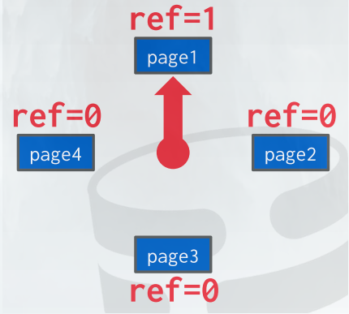

#### LRU 和 CLOCK 的问题

对于一个序列操作来说（扫描整个table），LRU 和 clock 反而可能会使效率下降，因为大部分数据只会在扫描的时候被读入进来一次然后再也不会使用，这样的话，最经常使用的 page （最后一个被扫描进来的） 实际上可能是最不需要的 page，具体可以参考以下例子，执行 Q1 的时候先把 page 0 读进来，然后执行 q2 的时候因为是一个扫描操作所以按顺序读取 page1 和 page2 进来，当需要读 page3 的时候，因为 lru 所以把 page0 释放掉了，注意如果我们接下来执行的 q3 和 q0 一样化，page0 才是我们需要保留的：

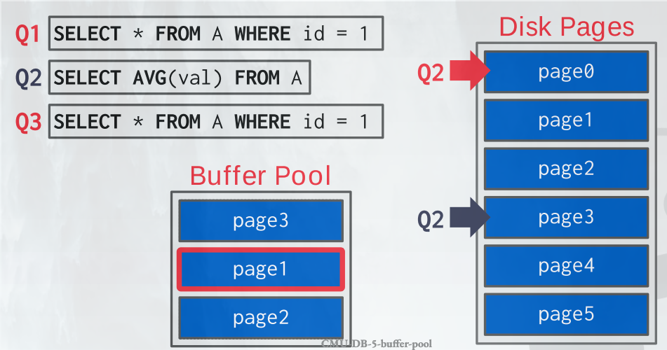

#### 改进的策略

- 追踪前 k 个被访问的 page 并根据时间戳来计算某个相邻 page 的访问时间，并以此来估计当前 page 下一次被访问的时间。
- 定位：DBMS追踪每个 query 使用的 page，并针对其来进行选择哪个释放，这样可以最大程度的避免因为一个 query 的操作来将另一个 query 常使用的page 释放掉
- 优先级提示：因为DBMS知道query中涉及的每个 page 的内容，可以用它来提示哪个 page 更加重要

#### Dirty Page

我们有两种方式来处理 dirty page（被修改过的）：

- 快速方法：如果当前 page 没被修改过，可以直接释放掉，无需和 disk 进行交互
- 慢：如果当前 page 修改过，需要将其重新写入 disk

我们选择哪类 page 来释放的时候需要考虑 trade off: 快速释放没被修改过的 page （但是有可能经常访问）还是 写入一个在短时间都不会访问的但是被修改过的 page。DBMS 可以周期性的进行一些后台访问 page table 并将 dirty page　写入　disk　里然后重置它的dirty flag（但是需要注意不能再dirty flag 被设为１和 该页实际被修改之间的时间进行写入！）。

## Lecture #06: Hash tables

### 1. 数据结构

- DBMS在不同地方使用各种数据结构：
  - **Internal Meta-Data:** Keep track of information about the database and the system state. 
  - **Core Data Storage:** Can be used as the base storage for tuples in the database. 
  - **Temporary Data Structures**: The DBMS can build data structures on the fly while processing a query to speed up execution (e.g., hash tables for joins). 
  - **Table Indexes**: Auxiliary data structures to make it easier to find specific tuples.

- 设计决定：
  - 数据组织: how we layout memory and what information to store inside the data structure.
  - 并发：how to enable multiple threads to access the data structure without casuing problems

### 2. Hash Table

由两部分构成：

- Hash Function: how to map a large key space into a smaller domain. this is used to computer an index into an array of buckets ro slots。需要权衡快速执行和collision rate
- Hashing scheme: hashing之后如何处理碰撞。需要权衡分配一个大的hash表减少collision的需求和执行额外指令去寻找/插入keys

### 3. Hash Function

for any input key, return an integer representation of thet key

not use a cryptorgraphic hash function for DBMS hash tables.

care about fast and collision rate

现在 state-of-the-art hash function is Facebook XXHash3.

### 4. Static Hashing schemes

哈希表的大小确定的时候，如果超过storage，需要重建一个更大的表。一般而言，新的哈希表是原来哈希表的两倍。

#### 4.1 liner probe hashing

最基础的hashing scheme。也是最快的，他用了一个table of slots. 

- resolve collision by linearly searching for the next free slot in the table
- To see if value is present, go to slot using hash, and scan for the key. The scan stops if you find the desired key or you encounter an empty slot.

Non-unique keys:

- Separate linked list: store values in separate storage area for each key.
- Redundant keys: store duplicate keys entries together in the hash table

#### 4.2 robin hood hashing

This is an extension of linear probe hashing that seeks to reduce the maximum distance of each key from their optimal position in the hash table. Allows threads to steal slots from “rich” keys and give them to “poor” keys.

- Each key tracks the number of positions they are from where its optimal position in the table. 
- On insert, a key takes the slot of another key if the first key is farther away from its optimal position than the second key. The removed key then has to be re-inserted back into the table

#### 4.3 cuckoo hashing

用具有不同hash function 的table，相同的algo不同的seed values

- 插入的时候，检查每个表然后选一个有free slot的
- 如果没有表有free slot，evict element from one of them, and rehash it to find a new location.
- If we find a cycle, then we can rebuild all of the hash tables with new hash function seeds (less common) or rebuild the hash tables using larger tables (more common).

### 5. Dynamic Hashing Schemes

前面的哈希表需要DBMS知道它想存元素的数量

动态哈希表根据需求resize themselves

#### 5.1 Chained Hashing

This is the most common dynamic hashing scheme. The DBMS maintains a linked list of buckets for each slot in the hash table.

- resolve collisions by placing elements with same hash key into the same bucket.
- if bucket is full, add another bucket to that chain. The hash table can grow infinitely because the DBMS keeps adding new buckets.

#### 5.2 Extendible Hashing

Chained-hashing approach where we split buckets instead of letting the linked list grow forever

multiple slot locations can point to the same bucket chain

reshuffing bucket entries on split and increase the number of bits to examine.

- Data movement is localiszed to just the split chain.
- the DBMS maintains a global and local depth bit counts that determine the number bits needed to find buckets in the slot array.
- when a bucket is full, the DBMS splits the bucket and reshuffle its elements. If the local depth of the split bucket is less than the global depth, then the new bucket is just added to the existing slot array. Otherwise, the DBMS doubles the size of the slot array to accommodate the new bucket and increments the global depth counter .

#### 5.3 Linear Hashing

哈希表维持一个追踪下一个to split 的bucket指针

Instead of immediately splitting a bucket when it overflows, this scheme maintains a split pointer that keeps track of the next bucket to split. No matter whether this pointer is pointing to the bucket that overflowed, the DBMS always splits. The overflow criterion is left up to the implementation.

- when any bucket overflows, split the bucket at the pointer location by adding a new slow entry, and create a new hash function
- if hash function maps to slot that has previously been pointed to by pointer, apply the new hash function,
- when pointer reaches last slot, delete original hash function and replace it with new hash function.

### Lecture #07: Tree Indexes 1

#### 1. Indexes

- 数据结构：internal meta-data\ core data storage\ temporary data structures\ table indexs(replica of a subset of a table's attributes that are organized and/or sorted for effient access using a subset of those attributes)

- DBMS ensures that the contents of the table and the index are logically in sync.

- Trade-off on the numbers of indexs to create per database: 1. storage overhead 2.maintenance overhead

#### 2. B+Tree

- Self-balancing treee data structure that keeps data sorted and allows searches, sequential access.
- 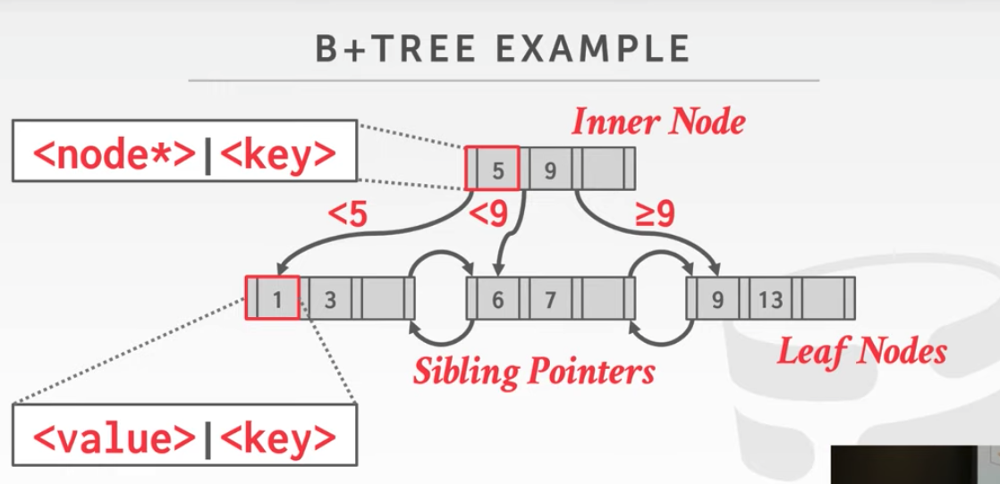
- b+ tree node  is comprised of an array of key/value pairs
- 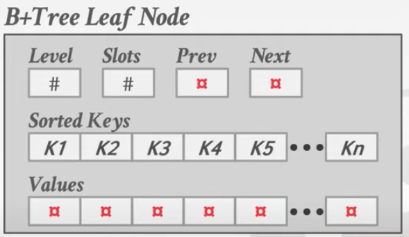
- left node values
  - recode ids: a pointer to the location of the tuple that the index entry corresponds to.
  - tuple data: the actual contents of the tuple is stored in the leaf node. scondary indexes have to store the record id as their values

- 插入

  1. find correct leaf L.
  2. add new entry into L in sorted order:
     - if L has enough space, the operation done
     - Otherwise split L into 2 nodes L and L2. Redistribute entries evenly and copy up middle key. Insert inde entry pointing to L2 into parent of L.
  3. To split an inner node, redistribute entries evenly, but push up the middle key.

- deletion

  1. find correct leaf L.
  2. remove the entry:
     - if L is at least half full, the operation is done.
     - Otherwise, you can try to redistribute, borrowing from sibling.
     - if redistribute fails, merge L and sibling.
  3. if merge occurred, you must delete entry in parent pointing to L.

- clustered indexes

  the table is stored in the sort of order specified by the primary key.(can be either heap- or inde x-organized storage).

- selection condition

  - the DBMS can use a B+ Tree index if the query provides any of the attributes of the search key.
  - 比如： index on <a, b, c>，可以查询(a=5 AND b=3) or (b=3)
  - 不是所有DBMS都支持，对于hash index来说，我们在search key中需要所有的属性。

#### 3. B+ Tree Design Decisions

- Node size:

  - 最佳的node size取决与磁盘的速度。
  - 磁盘越慢，理想的node size越大
  - optimal size can vary depending on the workload

- Merge Threshold:

  - 一些DBMS当半空的时候不会总是合并结点
  - Delaying a merge operation may reduce the amount of reorganization
  - 有时候最好先let underflow to exist然后周期性的重建整个树（银行维护中会做的事情之一

- Variale Length keys:

  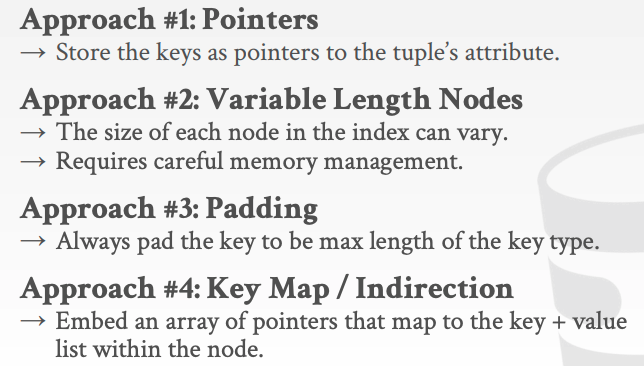

- Non-unique indexes

  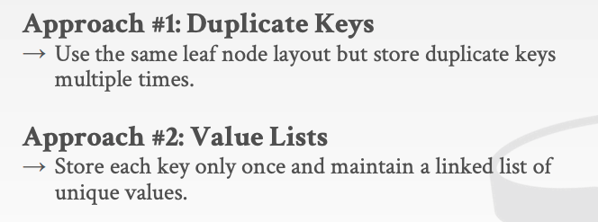

- Intra-Node Search

  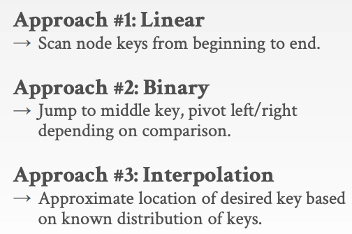

approach 3: aka do some math

#### 4. B+Tree Optimizations

- **prefix compression**: 排序后的叶子结点likely to have same prefix, Instead of storing the entire key each time, extract common prefix and store only unique suffix for each key

  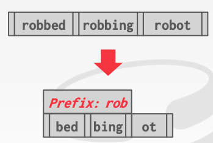

- Suffix truncation: 
  - The keys in the inner nodes are only used to “direct traffic”, we do not need the entire key. 
  - Store a minimum prefix that is needed to correctly route probes into the index.

- Bulk Inserts:
  - The fastest way to build a B+Tree from scratch is to first sort the keys and then build the index from the bottom up. 
  - This will be faster than inserting one-by-one since there are no splits or merges.

- Pointer Swizzling
  - Nodes use page ids to reference other nodes in the index. The DBMS must get the memory location from the page table during traversal.
  - If a page is pinned in the buffer pool, then we can store raw pointers instead of page ids. This avoids address lookups from the page table.

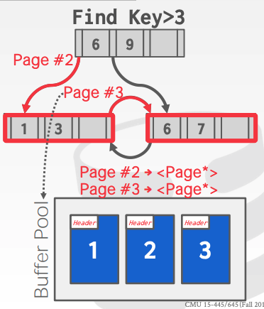

### Lecture #08: Tree Indexes 2

#### 1. more B+ Trees

- duplicate keys
  - append record ID:
    - add the tuple's uniques record id as part of the key to ensure that all keys are unique.
      - Record id (page, slot)
    - The DBMS can still use partial keys to find tuples.
  - overflow leaf nodes
    - 允许叶子结点spill into overflow nodes that contain the duplicate keys
    - this is more complex to maintain and modify

##### 2. Additional index usage

1. **Implicit indexes**: most DBMSs will automatically create an index to enforce integrity constarints.(e.g, primary keys, unique constrains)
2. **Partial indexes:**  create an index on a subset of the entire table. this potentially reduce size and the amount of overhead to maintain it.
3. **Covering Indexes**: all attributes needed to process the query are available in an index, then the DBMS does not need to retrieve the tuple. The DBMS can complete the entire query just based on the data available in the index.
4. **Index include columns**: embed additional columns in index to support index-only queries
   - These extra columns are only stored in the leaf nodes and are not part of the search key.
5. FUNCTIONAL/EXPRESSION INDEXES: Store the output of a function or expression as the key instead of the original value. It is the DBMS’s job to recognize which queries can use that index.

#### 3. Radix Tree

A radix tree is a variant of a trie data structure. It uses digital representation of keys to examine prefixes one-by-one instead of comparing entire key. It is different than a trie in that there is not a node for each element in key, nodes are consolidated to represent the largest prefix before keys differ.

The height of tree depends on the length of keys and not the number of keys like in a B+Tree. The path to a leaf nodes represents the key of the leaf. Not all attribute types can be decomposed into binary comparable digits for a radix tree.

**Omit all nodes with only a single child.**

树索引适合点和范围queries，不适合keyword search

#### 4. Inverted Indexes

An inverted index stores a mapping of words to records that contain those words in the target attribute. These are sometimes called a full-text search indexes in DBMSs.

**Query Types:** 

- Phrase Searches: Find records that contain a list of words in the given order.
-  Proximity Searches: Find records where two words occur within n words of each other. 
- Wildcard Searches: Find records that contain words that match some pattern (e.g., regular expression).

**Desgin Decisions:**

- What To Store: The index needs to store at least the words contained in each record (separated by punctuation characters). It can also include additional information such as the word frequency, position, and other meta-data.
- When To Update Updating an inverted index every time the table is modified is expensive and slow. Thus, most DBMSs will maintain auxiliary data structures to “stage” updates and then update the index in batches.

