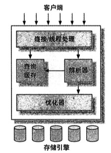
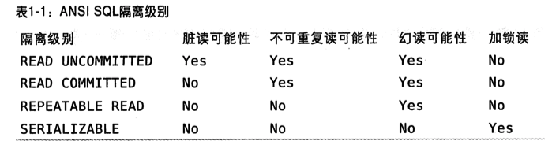
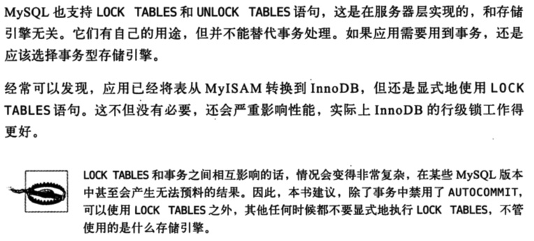
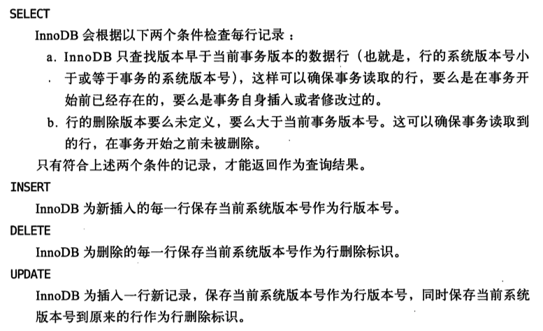

# 高性能MySQLNotes

> Reference：《高性能MySQL》

## 第一章 MySQL架构与历史

- MySQL服务器逻辑架构图

- 优化执行：解析查询，创建解析树，对其进行优化，包括重新查询、决定表的读取顺序以及选择合适的索引等。
- 在解析查询之前，服务器还会检查Query Cache
- 使用锁机制来进行并发控制：共享锁、排他锁，也叫读锁和写锁。
- 读锁是共享的，相互不排阻塞的。多个客户可以同一时刻同时读取同一个资源，互不干扰。写锁是排他的，一个写锁会阻塞其他的写锁和读锁。
- 锁的粒度：每种MySQL存储引擎都可以实现自己的锁策略和锁粒度。
- 表锁：最基本的锁策略，开销最小的，会锁定整张表。【在特定场景中，有良好的性能，比如：READ LOCAL表锁支持某些类型的并发写操作）写锁有比读锁更高的优先级，因此一个写锁请求可能会被插入到读锁队列前面。
- MySQL本身会使用各种有效的表锁来实现不同的目的。
- 行级锁：最大程度地支持并发处理，同时也带了了最大的表开销。行级锁只在存储引擎层实现，mysql服务器层没有实现，服务器层完全不了解存储引擎中的锁实现。
- 事务：一组原子性的SQL query，要么全部执行成功，要么全部失败。
- 使用`START TRANSACTION`开始一个事务， 使用`COMMIT`提交事务将数据持久保留， `ROLLBACK`用来撤销所有的修改。
- **重要点**：事务的ACID：atomicity原子性、consistency一致性、isolation隔离性、durability持久性。一个运行良好的事务处理系统，必须具备这些标准特性。
  - **原子性**：一个事物必须要被视为一个不可分割的最小工作单元，整个事务的所有操作要么全部提交成功，要么全部失败回滚，对于一个事务来说，不可能只执行其中的一部分操作，这就是事务的原子性。
  - **一致性**：数据库总是从一个一致性的状态转换到另外一个一致性的状态。
  - **隔离性**：通常来说，一个事务所做的修改在最终提交前，对其他食物不可见。在隔离级别中，会发现为什么我们要用“通常来说”是不可见的。
  - **持久性**：一旦事务提交，则其所做的修改就会永久保存到数据库中。此时即使系统崩溃，修改的数据也不会丢失。但是这个概念优点模糊，后面会讨论真正的含义。

- 隔离级别：SQL标准中定义了四种隔离级别。

  - **READ UNCOMMITEED（未提交读）**

    该级别，事务的修改，就是没有提交，对其他事务也都是可以见的。事务可以读取为提交的数据，这被称为**脏读**（Dirty Read）。这个级别会导致很多问题，从性能上来说，它不会比其他的级别好太多，但却缺乏其他级别的很多好处，除非真的有非常必要的理由，实际应用中一般很少用

  - **READ COMMITTED（提交读）**

    大多数数据库系统的默认隔离级别都是这个（mysql不是），该级别满足了前面提到的隔离性的简单定义。换句话说，一个事务从开始直到提交之前，所做的任何修改对其他事务都是不可见的。这个级别有时候也叫做**不可重复读（nonrepeatable read），因为两次执行同样的查询，可能得到不一样的结果。**

  - **REPEATABLE READ（可重复读）**

    解决了脏读问题，该级别保证了在同一个事务中多次读取同样记录的结果是一致的。但是理论上，可重复读隔离级别还是无法解决另外一个**幻读（Phantom Read）的问题。所谓幻读，指的是当某个事务在读取该范围的记录时，会产生幻行。**InnoDB和XtraDB存储引擎通过多版本并发控制MVCC解决了幻读问题。这是MySQL的默认事务隔离级别。

  - **SERIALIZABLE（可串行化）**

    最高的隔离级别，强制事务串行执行，避免了前面说的幻读问题。简单来说，该级别会在读取的每一行数据都加上锁，所以可能导致大量的超时和锁争用的问题。实际应用中也很少用到这个隔离级别，只有在非常需要确保数据一致性而去可以接受没有并发的情况下，才考虑使用该级别。

- **死锁：**两个或者多个事务在同一资源上相互占用，并请求锁定对方占用的资源，从而导致恶性循环的现象。当多个事务试图以不同的顺序锁定资源时，就可能会产生思索。多个事务同时锁定一个资源，也会产生。

- 死锁检测和死锁超时机制：1）检测到死锁的循环依赖，立即返回一个错误。否则会出现很慢的查询。2）查询时间达到锁等到超时的设定后放弃锁请求，不太好。InnoDB处理死锁的方法：将持有最少行级排他锁的事务进行回滚。

- 死锁产生的原因：1）因为真正的数据冲突。2）由于存储引擎的实现方式导致的。

- 死锁发生后，只有部分或者全部回滚其中一个事务，才能打破死锁。这是无法避免的，大多数情况下只要重新执行因死锁会滚的事务即可。

- 事务日志：预写式日志，修改数据需要写两次磁盘。

- MySQL中有两种事务型的存储引擎：InnoDB和NDB Cluster。

- MySQL默认采用AUTOCOMMIT，如果不是现实开始一个事务，则每个查询都被当作一个事务执行提交的操作。可以通过设置AUTOCOMMIT变量来启动或者禁用自动提交模式。

- 修改AUTOCOMMIT对非事务的表，例如MyISAM或者内存表，不会有任何影响，因为他们没有提交和回滚的概念。

- 在事务中混合使用事务型和非事务型的表（例如InnoDB和MyISAM表）

- 隐式和显式锁定

  - InnoDB采用的两阶段锁定协议
  - 事务执行过程中，随时都可以执行锁定，锁只有在执行COMMIT或者ROLLBACK的时候才会释放，并且所以的锁是在同一时刻被释放。前面描述的锁定都是隐式锁定，InnoDB会根据隔离级别在需要的时候自动加锁。

  

- 多版本并发控制：通过保存数据在某个时间点的快照来实现的

- 不同引擎的MVCC实现是不同的：乐观和悲观并发控制。

- InnoDB的MVCC在每行记录后面保存两个隐藏的列来实现。这两个列每一个保存了行的创建时间，一个保存了行的过期时间。存储的是系统版本号。

  

