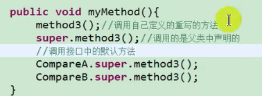

# Core Java 1 Learning Notes

## Chapter 1 Java程序设计概述

白皮书关键术语：简单性、面向对象、分布式、健壮性、安全性、体系结构中立、可移植性、解释型、高性能、多线程、动态性

## Chapter 2 Java程序设计环境

JDK-Java Deleopment Kit，JRE-Java Runtime Environment

## Chapter 3 Java的基本程序设计结构

1. 一般使用int，byte和short类型主要用于特定场合，例如，底层的文件处理或者需要控制占用存储空间的大数组。
2. 长整型数值有一个后缀L或l。十六进制数值有一个前缀0x或者0X。八进制有个前缀0。
3. java7开始，加上前缀0b或0B就可以写二进制数，还可以为数字字面量加下划线。
4. java中，所有的数值类型所占据的字节数量与平台无关，这一点与C/C++不同，这样对编写跨平台程序带来了方便。Java没有任何无符号形式的int、long、short或byte类型。
5. 对于浮点类型，float类型数值有一个后缀F或f。没有后缀F的浮点数值默认为double类型（当然也可以在后面加D或d）PS：可以使用十六进制表示浮点数值，例如：0.125=2-3可以表示成0x1.0p-3。p表示指数，不是e。
6. 三个特殊的浮点数：Double.POSITIVE_INFINITY, Double.NEGATIVE_INFINITY和Double.NaN。用Double.isNaN(x)来判断是否为NaN。
7. final表示常量，习惯上用全大写。
8. 要检测两个字符串是否相等，需要使用equals，一定不要使用==运算符，因为这个运算符只能确定两个字符串是否放置在同一个位置上。如果虚拟机始终将相同的字符串共享，就可以使用==运算符检测是否相等。但实际上只有字符串常量是共享的，而+或substring等操作产生的结果并不是共享的。
9. Java没有提供运算符重载功能，比如载大数值中需要用其类中的add和multiply方法。
10. 数组拷贝使用Arrays.copyOf(luckyNumber, 2*luckyNumbers.length);
11. java应用程序的main方法中，程序名并没有存储载args数组中。

## Chapter 4 对象与类

1. 设计类的简单规则是在分析问题的过程中寻找名词，而方法对应着动词。
2. 类直接的关系：依赖、聚合、继承
3. 在java中，任何对象变量的值都是对存储在另外一个地方的一个对象的引用。new操作符的返回值也是一个引用。
4. 建议将实例域标记为private关键字，确保只有类本身的方法能够访问这些，而其他类的方法不能够读写这些域。
5. java的构造器的工作方式与c++一样，但是要记得所有的java对象都是在堆中构造的，构造器总是伴随new操作符一起使用。
6. 注意在所有方法中不要命名与实例域同名的变量。
7. 可以使用this关键字将实例域和局部变量明显地区分开来。
8. 不能简单的给实例域加public关键字是为了确保其不会受外界的破坏。
9. 域访问器方法和域更改器方法是公有的。
10. 注意不要编写返回引用可变对象的访问器方法，如果需要返回一个可变数据域的拷贝，要使用clone。
11. final修饰符大都应用基本类型域，或不可变类的域。
12. 静态域，每个类中只有一个这样的域。而每个对象对于所有的实例域却都有自己的一份拷贝。
13. 本地方法可以绕过java语言的存取控制机制。所以在System类中，有一个setOut方法可以将System.out设置为不同的流。尽管其为final变量。
14. 静态方法不能向对象实施操作的方法。在一个方法不需要访问对象状态，其所所需参数都是通过显示参数提供的时候，还有只需要访问类的静态域的时候使用它。
15. 隐式参数：是出现在方法名前的类对象。显式参数是方法名后面括号中的数值。
16. 程序设计语言将参数传递给方法（或函数）的一些专业术语：按值调用表示方法接收的是调用者提供的值。按引用调用表示方法接收的是调用着提供的变量地址。Java总是采用按值调用。方法得到的是所有参数值的一个拷贝，方法不能修改传递给它的任何参数变量的内容。
17. 一个方法不能修改一个基本数据类型的参数、一个方法可以改变一个对象参数的状态，一个反复不能让对象参数引用一个新的对象。
18. 方法的签名：要完整地描述一个方法，需要指出方法名以及参数类型，返回类型不是方法签名的一部分。
19. finalize方法将在垃圾回收器清除对象之前调用。（实际上不怎么用，因为不知道什么时候可以被调用）
20. 当导入的包发生命名冲突的时候，就不能不注意包的名字。
21. javac对文件进行操作（带有文件分隔符和扩展名.java的文件。java解释器加载类（带有.分隔符）
22. 最好采用java -classpath选项指定类路径。
23. 多用：`/** */`注释
24. 方法注释：@param变量描述，@return描述，@throw描述
25. summary：保证数据私有、对数据初始化、不要再类中使用过多的基本类型、不是所有的域都需要独立的域访问器和域更改器、将指责过多的类进行分解、类名和方法名要能够体现它们的职责、优先使用不可变的类。

## Chapter 5 继承

1. 放射是指在程序运行期间发现更多的类及其属性的能力。

2. 关键字`extends`表示继承

3. 利用super关键字调用超类中的方法，super不是一个对象的引用，不能将super赋给另一个对象变量，它只是一个指示编译器调用超类方法的特殊关键字。

4. 一个对象变量可以指示多种实际类型的现象被称为多态。运行时能够自动地选择调用哪个方法的现象称为动态绑定。

5. java不支持多继承。有关java中多继承功能的实现方式，参考接口。

6. 在java中，对象变量是多态的，一个父类变量既可以引用一个父类对象，还可以引用任何一个子类的对象。

7. 方法的调用：

   1. 编译器先查看对象的声明类型和方法名。需要注意的是：可能存多个名字相同，参数类型不一样的方法。like：可能存在f(int)和f(String)。编译器会一一列举所有C类中名为f的方法和其超类中访问属性味public且名为f的方法（超类的私有方法不可以访问）。这一阶段，编译器已获得所以可被调用的候选的方法。
   2. 编译器将查看调用方法时提供的参数类型。如果在所有名为f的方法中存在一个与提供的参数类型完全匹配，就选择这个方法。这个过程被称为重载解析。这个过程很复杂（允许类型转换等等），所以这个过程可能很复杂。如果编译器没有找到与参数类型相配的方法，或者发现经过类型转换后有多个方法与之匹配，就会报告一个错误。这时，编译器已获得需要调用的方法名字和参数类型。
   3. 每次调用方法都需要进行搜索，时间开销大。**解决方法：虚拟机预先为每个类创建了一个方法表，其中列出了所有方法的签名和实际调用的方法**。
   4. 动态绑定的重要特性：无需对现存的代码进行修改，就可以对程序进行扩展。
   5. **⚠️**：在覆盖一个方法的时候，子类的方法不能低于超类方法的可见性。特别是，如果超类方法是public，子类方法一定要声明为public。经常会发生这类错误：在声明子类方法的时候，遗漏了public修饰符。此时，编译器将会把它解释为试图提供严格的访问权限。

8. 不允许扩展的类被称为final类。

9. 类只允许在继承层次内进行类型转换

10. 在将超类转换为子类之前，应该使用instanceof进行检查。

11. 抽象类：

    1. 充当占位的角色，具体实现在子类中。
    2. 抽象类不能被实例化，需要创建一个具体子类。
    3. 需要注意，可以定义一个抽象类的对象变量，但是它只能引用非抽象子类的对象。`Person p = new Student("Vince Vu", " Economics");`

12. private-仅对本类可见、public-对所有类可见、protected-对本包和所有子类可见、对本包可见-默认，不需要修饰符

13. Object类是java中所有类的始祖。

    1. 关于equals

    2. hashCode方法

       由对象导出的一个整型值，没有规律，两个相等的对象要求返回相等的散列码。

    3. toString方法

14. 泛型数组列表

    1. ArrayList，具有自动调节数组容量的功能，而不需要为此编写任何代码
    2. 是一个采用类型参数的泛型类。在<类型>
    3. 当内部数组满了，可以自动创建一个更大的数组，将所有对象从较小的数组拷贝到较大的数组里。
    4. size方法想到与数组a的a.length
    5. ensureCapacity可以确定数组列表容量，trimToSize可以将存储区域的大小调整为当前元素数量所需要的存储空间数目。垃圾回收器将回收多余的存储空间。
    6. 与c++中vector类似，不同的是vector是值拷贝，java是引用。

15. 对象包装器

    1. 包括：Integer, Float, Double, Short, Byte, Character, Void和Boolean
    2. 不可变，并且对象包装类是final，不能定义它们的子类。
    3. 有自动装箱和拆箱功能：【编译器认可的，不是虚拟机】
       1. 自动装箱：`list`是`ArrayList<Integer>`,`list.add(3)` 自动变换为 `list.add(Integer.valueOf(3)); `
       2. 自动拆箱：`int n = list.get(i)`被翻译成`int n = list.get(i).intValue();`
    4. 如果想编写一个修改数值参数值的方法，可以用org.omg.CORBA包中定义的持有者类型。包括IntHolder等。每个holder都包含一个公有域值，通过它可以访问存储在其中的值。

16. 继承的设计技巧：

    1. 将公共操作和域放在超类
    2. 不要使用protected：1）子类集合是无限制的，会破坏封装性。2）在java中，在同一个包中所有类都可以访问protected域，而不管它是否为这个类的子类。
    3. 除非所有继承的方法都有意义，否则不要使用继承。
    4. 在覆盖方法时，不要改变语气的行为
    5. 使用多态，而非类型信息：更容易维护和扩展。
    6. 不要过多地使用反射

## Chapter 6 接口、lambda表达式与内部类

### 接口

1. 接口是对类的一组需求描述，这些类要遵从接口描述的统一格式进行定义

2. 接口的本质是契约、

3. JDK8: 除了定义全局常量和抽象方法之外，还可以定义静态方法、默认方法

   1. 接口中定义的静态方法，只能通过接口来调用

   2. 通过实现类的对象，可以调用接口中的默认方法，如果实现类重写了接口中的默认方法，调用的是重写以后的方法。

   3. 如果子类（或实现类）继承的父类和实现的接口中声明了同名同参数的方法，子类在没有重写此方法的情况下，默认调研的是父类中的同名同参数方法（类优先原则）

   4. 如果实现类实现了多个接口，而这多个接口中定义了同名同参数的默认方法，那么在实现类没有重写此方法的情况下，报错（接口冲突）

   5. 如何在子类中调用父类（接口）的默认方法

      

   6. 

### 内部类

1. java中允许一个类A声明在另一个类B中，则类A就是内部类，类B称为外部类
2. 内部类的分类：成员内部类（静态、非静态） vs 局部内部类（方法内、代码块内、构造器内。
   1. 成员内部类：一方面，作为外部类的成员：调用外部类的结构，可被static修饰，可以被4种不同的权限修饰，另一方面，作为一个类：类内可以定义属性方法，构造器等，可以呗final修饰，表示此类不能被继承，可以呗abstract修饰。