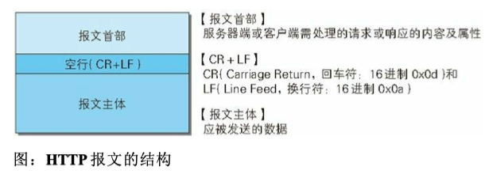
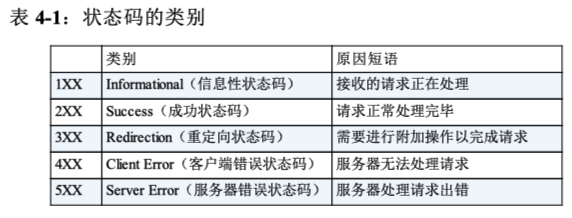
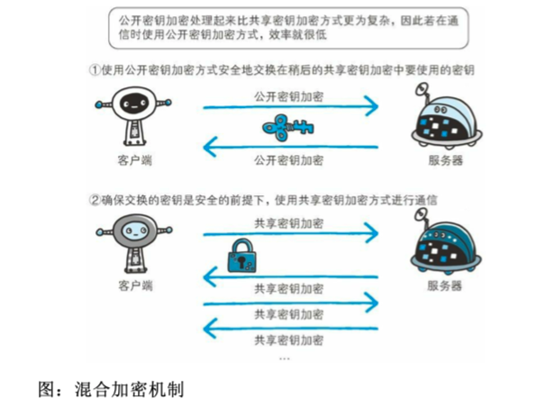

# Notes for HTTP

> Reference: 《图解HTTP》

## Chapter 1 了解Web以网络基础

### 1.1 使用HTTP协议访问Web

大致过程：根据web浏览器中的URL，web浏览器从web服务器端获取resource等信息，从而显示出web页面。

发出请求获取服务器资源的web浏览器等，可以称为客户端。

而web使用HTTP(hyperText Transfer Protocol)，来进行客户端到服务端等一系列运作流程。而协议是指规则的约定，可以说，**web是建立在http协议上通信的。**

### 1.2 HTTP的诞生

当年HTTP的出现主要是为了解决文本传输的难题。由于协议本身本身简单，于此基础上已经应用到很多其他的场景中了。

目前我们用的大多是HTTP1.1，HTTP2.0在制定当中，但是普及可能还需要时间。

### 1.3 网络基础TCP/IP

TCP/IP是互联网相关的各类协议族的总称

## Chapter 2 HTTP协议

http无状态-》cookie

GET：获取资源、POST：传输实体主体、PUT：传输文件、DELETE：删除文件、OPTIONS：询问支持的方法、TRACE：追踪路径（让web服务器将之前的请求通信环回给客户端的方法）

持久连接节省通信量：keep-alive或者HTTP connection reuse的方法，只要任意一端没有明确提出断开连接，则保持TCP连接状态。减少了TCP连接的重复建立和断开锁造成的额外开销，减轻了服务器端的负载。

pipelineing方式：不用等待响应亦可直接发送下一个请求。

cookie，通过第一次响应，服务端发set-cookie首部字段信息，通知客户端保存Cookie

## Chapter 3 HTTP报文内的HTTP信息

获取部分内容的范围请求：206 Partial Content

内容协商：服务器驱动-客户端驱动-透明协商

## Chapter 4 返回结果的HTTP状态

301 moved permanently

302 Found

303 See other

304 Not Modified：资源找到，但是没有符合条件，返回不包含任何响应的主体部分。

307 Temporary Redirect

400 Bad Request: 请求报文存在语法错误。

401 Unauthorized：返回弹出认证用的对话窗口

状态码和状况不一致经常发生。

## Chapter 5 与HTTP协作的Web服务器

在相同的IP地址下，由于虚拟主机可以寄存多个不同主机名和域名的web网站，因此在发送HTTP请求的时候，必须在Host首部内完整指定主机名或域名的URI

1. 代理：利用缓存技术减少网络带宽的流量，预先将资源的副本保存在代理服务器上
2. 网关：可以油HTTP请求转化为其他协议通信
3. 隧道：可以按要求建立起一条与其他服务器的通信路线：使用SSL等加密手段进行通信

缓存发生在转发响应时，复制资源后保存在缓存服务器上。

客户端还可以缓存在客户端浏览器中

## Chapter 6 HTTP 首部

如果出现重复的字段：不同的浏览器处理方法不同：有的可能优选处理第一次出现的首部字段，有的则优先处理最后出现的首部字段。

## Chapter 7 确保Web安全的HTTPS

HTTP + 加密 + 认证 + 完整性保护 = HTTPS

