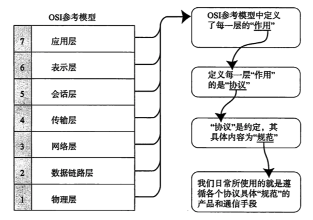

# Notes for TCP/IP

> Reference: 《图解TCP/IP》

## Chapter 1 网络基础知识

### 计算机网络发展的7个阶段

1. 批处理(Batch Processing)

   事先将用户程序和数据装入卡带或磁带，并由计算机按照一定的顺序读取，使用户所要执行的这些程序和数据能够一并批量得到处理的方式

2. 分时系统

   多个终端与同一个计算机连接，允许多个用户同时使用一台计算机的系统。

3. 计算机之间的通信

4. 计算机网络的产生

   窗口系统的发明。

5. 互联网的普及

   连接异构型计算机的通信网络技术以及信息传播方式的发展（例如：email、WWW等）

6. 以互联网技术为中心的时代

7. 单纯建立连接到安全建立连接

### 协议

简单来说，协议就是计算机与计算机之间通过网络实现通信时事先达成的一种“约定”。对于不同的CPU已经不同OS的计算机之间，只要遵循相同的协议就能够实现通信。

分组交换协议：将大数据分割为一个个的叫做包（packet）的较小单位进行传输的方法。

协议标准化，让不同的厂商生产的异构产品之间具有兼容性、偏于使用规范化过程。

### 协议分层与OSI参考模型

上下层之间进行交互时锁遵循的约定叫做"接口"。同一层之间的交互所遵循的约定叫做”协议“。

协议分层的劣势：过于模块化，处理起来比较沉重而且每个模块不得不实现相似的处理逻辑。

#### OSI参考模型

1. 各个分层的作用：
   - 应用层：针对特定应用的协议，包括文件传输、电子邮件、远程登录等协议
   - 表示层：设备固有数据格式和网络标准数据格式的转换。
   - 会话层：通信管理。负责建立和断开通信连接（数据流动的逻辑通路）。管理传输层以下的分层。
   - 传输层：管理两个节点之间数据传输。负责可靠传输（确保数据被可靠地传送到目标地址）
   - 网络层：将数据传输到目标地址。地址管理与路由选择。
   - 数据链路层：互连设备之间传送和识别数据帧。
   - 物理层：负责0、1比特流与电压高低、光的闪灭之间的互换。

### 传输方式分类

1. 面向有连接型

   在发送数据之前，需要在收发主机之间连接一条通信线路，所以在传输前后，有专门的建立和断开连接的处理

2. 面向无连接型

   发送端可以自由发送数据，接收端需要时常确认是否收到了数据

3. 分组交换：发送端计算机将数据分组发送给路由器，路由器收到这些分组数据以后，缓存到自己的缓冲区，然后再转发给目标计算机。因此，分组交换也有另一个名称：蓄积交换

### 地址

- 地址的唯一性，IP地址的层次性。
- MAC地址有设备的制造厂商针对每块网卡进行分别指定。人们可以通过制造商识别号、制造商内部产品编号以及产品通用编号确保MAC地址的唯一性。因为无法确定哪家厂商的哪个网卡被用到哪个地方，所以对与寻址并没有任何作用，因此IP地址必不可少。
- 网卡：网络适配器
- 中继器：再生信号放大器
- 网桥/2 层交换机：根据数据帧的那内容转发数据给相邻的其他网络，没有连接个数限制，有自学机制。
- 具有网桥功能的hub叫做交换集线器，只有中继器功能的hub叫做集线器。【根据MAC地址处理】
- 路由器/3 层交换机：连接网络与网络的设备，可以将分组报文发送给另一个目标路由器地址【根据IP地址处理】，还可以分担网络复合。
- 4-7层交换机：负载均衡器就是4～7层交换机的一种。带宽控制可以设计优先处理的请求。
- 网关：负责协议的转换和数据的转发，在同一种类型的协议之间转发数据叫做应用网关（例如代理服务器）。防火墙就是一款通过网关通信，针对不同应用提高安全性的产品。

## Chapter 2 TCP/IP基础知识

