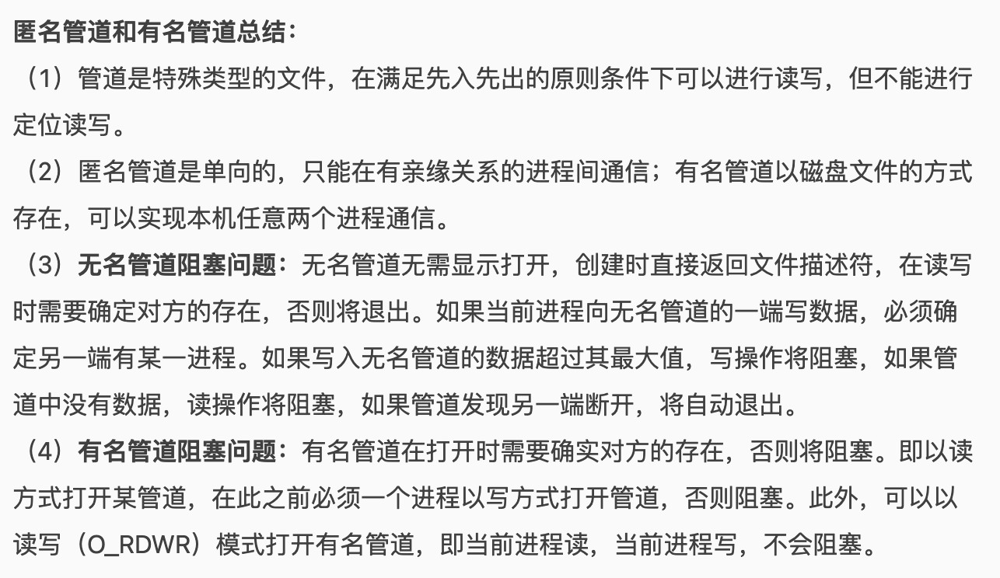
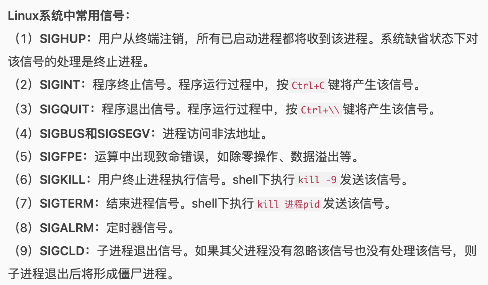
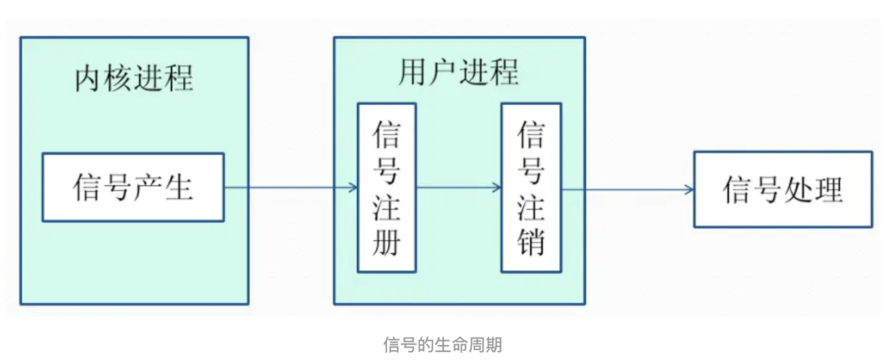
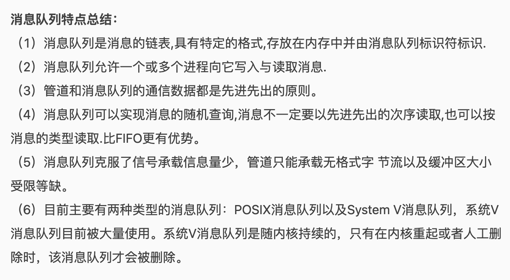
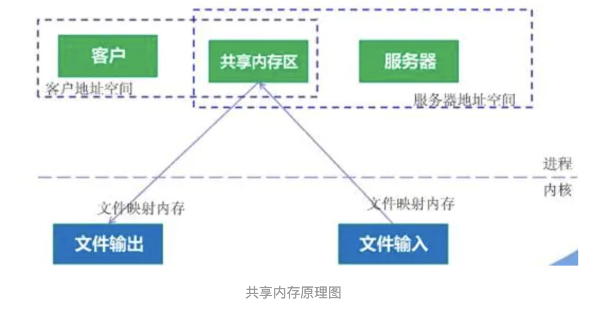
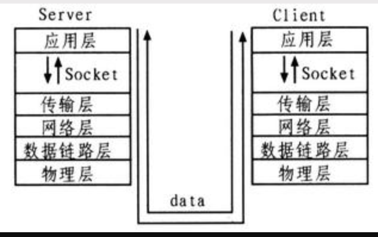
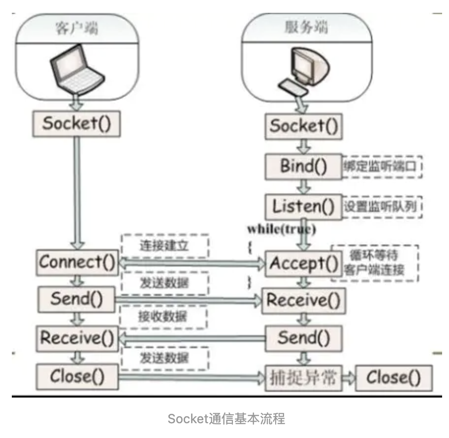

# InterProcess Communication

## 第一类：传统的Unix通信机制

### - 管道/匿名管道(pipe)

- 半双工，数据只能向一个方向流动；需要双方通信的时候，需要建立两个管道。
- 只能用于父子进程或者兄弟进程
- 单独构成文件系统，只存在内存中
- 数据的读写：写入的内容都在管道缓冲区的末尾，每次都是从缓冲区的头部读出数据

**管道的实质**：

内核缓冲区，FIFO的方式存取数据，缓冲区读空或者写满的时候，有一定规则控制相应的读进程或者写进程进入等待队列

**管道的局限**：

- 只支持单向数据流
- 只能用于具有亲缘关系的进程之间
- 没有名字
- 缓冲区是有限的
- 管道所传送的是无格式字节流，需要事先约定好数据

### - 有名管道（FIFO）

克服只能亲缘关系进程间通信的问题

提供了一个路径名相关联：**以有名管道的文件形式存在于文件系统中**，这样，**即使与有名管道的创建进程不存在亲缘关系的进程，只要可以访问该路径，就能够彼此通过有名管道相互通信**，名字存在文件系统中，内容存放在内存中。

### - 信号（signal）

可以在任何实际发给某进程，而无需知道该进程的状态，如果该进程当前没有处于执行状态，则该信号就有内核保存起来，知道该进程回复执行并传递给它为止。

如果一个信号被进程设置为阻塞，则该信号的传递被延迟，直到其阻塞被取消是才被传递给进程

来源：软件层面上对中断机制的一种模拟，是一种异步通信方式，可以在用户空间进程和内核之间直接交互，内核可以利用信号来通知用户空间的进程发生了哪些系统事件，信号事件主要有两个来源：

- 硬件来源：按ctrl+c退出、硬件异常如无效的存储访问
- 软件终止：终止进程信号、其他进程调用kill函数、软件异常产生信号。

信号生命周期和处理流程：

信号被进程产生，设置传递对象（对应进程pid），传递给OS-》OS根据进程的设置选择性发送给接收者（如果阻塞则保留）-〉目的进程接收到之后，终止当前代码执行，保留上下文（主要包括临时寄存器数量，当前程序位置以及当前CPU状态）、转而执行中断服务程序，执行完成之后回复到中断的位置。

### - 消息队列

- 存放在内核中的消息链条，每个消息队列由消息队列标识符表示。
- 与管道不同的是消息队列存放在内核中，只有在内核重启（reboot），或者显示地删除一个mq时，该消息队列才会被真正的删除
- 不需要另外进程在队列上等待消息的到达

### - 共享内存

- 使多个进程可以直接读写同一块内存空间，是最快的可用IPC形式。是针对其他通信机制运行效率低而设计的
- 内核专门留出了一块内存区，可以由需要访问的进程将其映射到自己的私有地址空间。
- 需要依靠某种同步机制（如信号量）来达到进程间的同步及互斥

### - 信号量

计数器，用于多进程对共享数据的访问，目的在于进程间同步

为了获得共享资源，进程需要执行下列操作：
 （1）**创建一个信号量**：这要求调用者指定初始值，对于二值信号量来说，它通常是1，也可是0。
 （2）**等待一个信号量**：该操作会测试这个信号量的值，如果小于0，就阻塞。也称为P操作。
 （3）**挂出一个信号量**：该操作将信号量的值加1，也称为V操作。

互斥量用于线程的互斥，信号量用于线程的同步

### - socket

不同计算机上的进程的通信

套接字是支持TCP/IP的网络通信的基本操作单元，可以看做是不同主机之间的进程进行双向通信的端点，简单的说就是通信的两方的一种约定，用套接字中的相关函数来完成通信过程。

socket的特性由三个属性确定：域、端口号、协议类型。

1. 套接字的域：

   它指定套接字通信中使用的网络介质，最常见的套接字域有两种：

   - **AF_INET**，**指的是Internet网络**，当客户使用套接字进行跨网络的连接时，它就需要用到服务器计算机的IP地址和端口来指定一台联网机器上的某个特定服务，所以在使用socket作为通信的终点，服务器应用程序必须在开始通信之前绑定一个端口，服务器在指定的端口等待客户的连接。
   - **AF_UNIX**，**表示UNIX文件系统**，它就是文件输入/输出，而它的地址就是文件名

2. socket的端口号：

   每一个基于TCP/IP网络通讯的程序(进程)都被赋予了唯一的端口和端口号，端口是一个信息缓冲区，用于保留Socket中的输入/输出信息，端口号是一个16位无符号整数，范围是0-65535，以区别主机上的每一个程序（端口号就像房屋中的房间号），低于256的端口号保留给标准应用程序，比如pop3的端口号就是110，每一个套接字都组合进了IP地址、端口，这样形成的整体就可以区别每一个套接字。

3. 套接字协议类型：

   - 流套接字：通过TCP/IP连接实现，有序、可靠、双向字节流的连接，因此发送的数据可以确保不会丢失、重复或乱序到达，而且还有一定的出错后重发的机制
   - 数据报套接字：通过UDP/IP协议实现的， 发送长度有限，速度比较快但是不可靠，因为基于UDP
   - 原始套接字：允许对较低层的协议直接访问，比如IP、ICMP协议，它常用于检测新的协议实现。或者访问现有服务中配置的新设备，网络监听技术很大程度上依赖于SOCKET_RAW。

   **原始套接字与标准套接字的区别在于：**
    原始套接字可以读写内核没有处理的IP数据包，而流套接字只能读取TCP协议的数据，数据报套接字只能读取UDP协议的数据。因此，如果要访问其他协议发送数据必须使用原始套接字。

   

