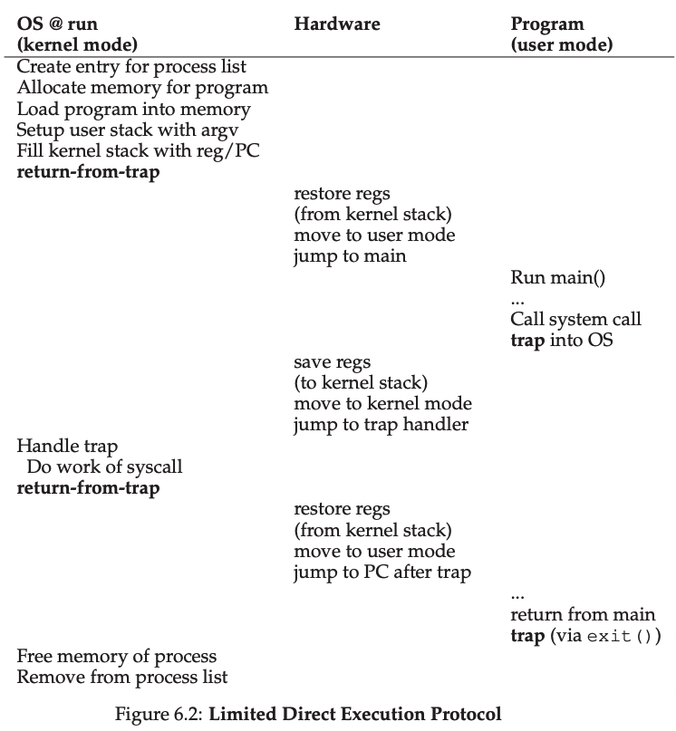

# Operating Systems Three Easy Pieces

**Topic: Virtulaization, Concurrency, Persistence**

> [Textbook](http://pages.cs.wisc.edu/~remzi/OSTEP/),[BookCode](https://github.com/remzi-arpacidusseau/ostep-code),[Projects](https://github.com/remzi-arpacidusseau/ostep-projects),[Homework](https://github.com/remzi-arpacidusseau/ostep-homework/),[CheatSheet](https://github.com/xxyzz/ostep-hw),[MIT6.826](https://pdos.csail.mit.edu/6.828/2020/schedule.html)

## Intro
### **Dialogue**
I hear and I forget. I see and I remeber. I do and I understand.

### **Introduction to Operating Systems**

- Three Pieces: **Virtualization, Conccurent, Persisetnce**.

   **CRUX**: how to virutalize resources.
  
  **CRUX**: how to build correct concurrent programs.
  
  **CRUX**: how to store data persistenlty?

 - **Von Neumann**
 - CPU is sometimes know as a resource manager.
 - Some concepts: virtualization, API, System calls, Standard Library.
 - 每个进程有他们自己private的虚拟地址空间
 - OS is seen as a standard library.
 - write有讲究：1）先延迟一会儿按batch操作 2）protocol, such as  journaling or copy-on-write 3)复杂结构 B-trees
 - Design Goal：
   - performance: minimize the overheads
   - protection: isolation
   - reliability
   - security
   - mobility
   - energy-efficiency
 - History:
   - libraries
   - protection: system call 
   - trap handler, user/kernel mode: return-from-trap
   - multiprogramming minicomputer
   - memory protection concurrency, ASIDE: The Importance Of [UNIX](https://www.youtube.com/watch?v=tc4ROCJYbm0)
   - modern era: PC Linux Torvalds: Linux

## Virtulization
### **Dialogue**

### **Processes**

- Defintion: a running program
- **CRUX**: How to provide the illusion of many CPUs?
- time sharing of the CPU allows users to run as many concurrent processes as they would like
- low-level machinery : **mechanisms**: low-level methods or protocols that implement a needed piece of functionality.
- Policies are algorithm for making some kind of decision within the OS. 在很多os中，共同的设计是将policy和mechanism分开，使用模块化。
- machine state: memory(指令和数据都在其中), registers: PC aka IP告诉我们下一条会执行的指令, stack pointer& frame pointer用来管理函数参数，局部变量和返回地址的栈
- Process API：
  - Creat、Destory、Wait、Miscellaneous Control、Status
- Process Creation
  - load lazily: paging and swapping
  - run-time stack; heap(malloc(),free()):for dynamically-allocated data
  - I/O setups: default file descriptors
- Process States
  - Running, Ready, Blocked
    
- Data Structures: process list, PCB
  - xv6 process structure
```cpp
 // the registers xv6 will save and restore
 // to stop and subsequently restart a process
 struct context {
     int eip;
     int esp;
     int ebx;
     int ecx;
     int edx;
     int esi;
     int edi;
     int ebp;
 };
 // the different states a process can be in
 enum proc_state { UNUSED, EMBRYO, SLEEPING,RUNNABLE, RUNNING, ZOMBIE };
 // the information xv6 tracks about each process
 // including its register context and state
 struct proc {
     char *mem;                  // Start of process memory
     uint sz;                    // Size of process memory
     char *kstack;               // Bottom of kernel stack
                               // for this process
     enum proc_state state;      // Process state
     int pid;                    // Process ID
     struct proc*parent;        // Parent process
     void *chan;                 // If !zero, sleeping on chan
     int killed;                 // If !zero, has been killed
     struct file *ofile[NOFILE]; // Open files
     struct inode *cwd;          // Current directory
     struct context context;     // Switch here to run process
     struct trapframe *tf;       // Trap frame for the
                                 // current interrupt
 };
```
- HW: run process-run.py
- `-i IO_RUN_IMMIDIATE`发生IO的进程接下来会有IO的概率大，因此这样比较高效。

### **Interlude: Process API**

- **CRUX**: How to Create and Control Process?
- fork() syscall is to create a new process
- wait() syscall won't return until the child has run and exited
- exec() syscall is useful when u want to run a program that is different from the calling program.
- the separation of fork() and exec() allows the shell to do a whole bunch of useful things rather easily.
- control-c: SIGINT(interrupt)
- ps: 可以看到在运行的进程
- top: 展示系统的进程而且他们占用了多少CPU和其他资源
- superuser可以控制所以的进程
- RTFM: read the Fucking manual
- HW：
  - [exec族函数的作用](https://blog.csdn.net/u014530704/article/details/73848573?utm_medium=distribute.pc_relevant.none-task-blog-BlogCommendFromMachineLearnPai2-4.channel_param&depth_1-utm_source=distribute.pc_relevant.none-task-blog-BlogCommendFromMachineLearnPai2-4.channel_param)
    
    - 我们用fork函数创建新进程后，经常会在新进程中调用exec函数去执行另外一个程序。当进程调用exec函数时，该进程被完全替换为新程序。因为调用exec函数并不创建新进程，所以前后进程的ID并没有改变。
    - 在调用进程内部执行一个可执行文件。可执行文件既可以是二进制文件，也可以是任何Linux下可执行的脚本文件。
    - exec函数族分别是：execl, execlp, execle, execv, execvp, execvpe
- 函数原型：
  
       ```c
       #include <unistd.h>
   extern char **environ;
   
       int execl(const char *path, const char *arg, ...);
       int execlp(const char *file, const char *arg, ...);
       int execle(const char *path, const char *arg,..., char * const envp[]);
       int execv(const char *path, char *const argv[]);
       int execvp(const char *file, char *const argv[]);
       int execvpe(const char *file, char *const argv[],char *const envp[]);
   ```
    
    - 返回值：exec函数族的函数执行成功后不会返回，调用失败时，会设置errno并返回-1，然后从原程序的调用点接着往下执行
    - 参数说明：
      - path：可执行文件的路径名字
      - arg：可执行程序所带的参数，第一个参数为可执行文件名字，没有带路径且arg必须以NULL结束
      - file：如果参数file中包含/，则就将其视为路径名，否则就按 PATH环境变量，在它所指定的各目录中搜寻可执行文件。
      - exec族函数参数极难记忆和分辨，函数名中的字符会给我们一些帮助：
      - l : 使用参数列表
      - p：使用文件名，并从PATH环境进行寻找可执行文件
      - v：应先构造一个指向各参数的指针数组，然后将该数组的地址作为这些函数的参数。
      - e：多了envp[]数组，使用新的环境变量代替调用进程的环境变量
  - [waitpid函数详解](https://blog.csdn.net/Roland_Sun/article/details/32084825)
  - [waitpid和wait的区别](https://www.cnblogs.com/yusenwu/p/4655286.html)
  - STDOUT_FILENO：向屏幕输出，STDIN_FILENO：接收键盘的输入
  - [read和write函数](https://www.cnblogs.com/xiehongfeng100/p/4619451.html)
  - [Linux进程间通信方式之pipe](https://blog.csdn.net/yangwen123/article/details/14118733?utm_medium=distribute.pc_relevant.none-task-blog-title-1&spm=1001.2101.3001.4242)
  ```

### **Mechanism: Limited Direct Execution**

1. **CRUX**: how to efficiently virtualize the CPU with control?
   
   - limited direct execution
2. **Problem1: Restricted Operations**
   1. **CRUX**: how to perform restricted operations?
   2. aside: open()和read()这些系统调用是trap call，写好了汇编，参数和系统调用号都放入了well-known的地方
   3. trap into the kernel return-from-trap, trap table, trap handler.
      1. on x86, per-process kernel stack, 用于进程的寄存器值，以便trap的时候寄存器够。
      2. 如何控制：set up trap table at boot time; 直j进任何内核地址是very bad idea
      3. user mode 不能 I/O request
   4. system call: accessing the file system, create and destroy processes, communicate with other processes, and allocate more memory(POSIX standard)
      1. 告诉硬件trap table在哪是privileged operation
      2. protection：user code放置desired system-call number，OS操作的时候看trap handler中的这个号码是否有效。
5. LDE有两个阶段：1)kernel初始化trap table， CPU记住它的位置为了之后使用（通过privileged instruction） 2)kernel设置一些事（分配节点到进程表，分配memory）在使用一个return-from-trap instruction之前去开始进程的运行。

   
3. **Problem 2: Switching Between Processes**
   1. **CRUX**: How to regain control of the CPU?
   2. A Cooperative approach: wait for system calls, yield syscall转移control to the OS。
      1. NOTE: only solution to infinite loops is to reboot the machine, reboot is useful.
      2. 重启的意义：1）回到确定无误的初始状态；2）回收过期和泄漏的资源；3）不仅适合手动操作，也易于自动化
   3. A Non-Cooperative approach: The OS takes control
      1. CRUX: How to gain control without copperation?
      2. a timer interrupt and interrupt handler
         1. start the timer is a priviledged operation
         2. timer can be turned off
      3. deal with misbehavior: in modern systems, the way the OS tries to handle such malfeasance is to simply terminate the offender.
      4. scheduler context switch
    

      5. 注意有两种形式的register saves/restores:
         1. timer interrupt: 用hardware, kernerl stack, implicitly, 存user registers.
         2. OS switch: 用software, process structure, explicitly, 存kernel registers
         3. e.gL xv6 context switch code.
      6. Note:
         1. 如何测context switch的成本：[LMbench](https://winddoing.github.io/post/54953.html)
         2. 如何处理concurrency? => locking schemes, disable interrupts 
         3. memory bandwidth 很多年没有明显变快。
         4. baby-proofing
4. HW：
   1. [pipe函数详解](https://blog.csdn.net/skyroben/article/details/71513385?utm_medium=distribute.pc_relevant.none-task-blog-BlogCommendFromMachineLearnPai2-1.channel_param&depth_1-utm_source=distribute.pc_relevant.none-task-blog-BlogCommendFromMachineLearnPai2-1.channel_param)
   2. [struct timeval结构体以及gettimeofday()函数](http://blog.chinaunix.net/uid-20548989-id-2533161.html)
   3. [MacOS上没有sched.h](https://blog.csdn.net/judgejames/article/details/84256340)
   4. [线程绑定CPU核-sched_setaffinity](https://blog.csdn.net/lanyzh0909/article/details/50404664)
   5. [多核时代不宜再使用x86的RDTSC指令测试指令周期和时间](http://www.360doc.com/content/12/0827/17/7851074_232649576.shtml)
   6. system call 大概0.47ms，context switch大概2ms。

### **Scheduling: Introduction**

**CURX**: How to develop scheduling policy?

1. Worked Assumptions

   - Fully-operational scheduling discipline 

   - assumptions: jobs

     1. Each job runs for the same amount of time. 

     2. All jobs arrive at the same time. 
     3. Once started, each job runs to completion. 
     4. All jobs only use the CPU (i.e., they perform no I/O)
     5. The run-time of each job is known.

2. Scheduling Metrics

   - Trunaround time: 完成工作的时间与到达时间之差
   - life isn't always perfect as performance and fairness are at odds in scheduling.

3. FIFO: Convoy effect ->(允许长度不等) SJF(shortest job first)->(允许来时不等)->()SJCF(Shortest Time-to-Completion First)->(运行不run to completion) new metric, <u>**response time: time from when the job arrives in a system to the first time it is sheduled.**</u>

   - 概念：preemptive schedulers
   - Round-Robin scheduling:
     - time slice aka scheduling quantum
     - 时间片长：amortize the cost of context switching
   - 针对I/O： overlap enables higher utilization

4. HW：

   - For what types of work loads does SJF deliver the same turnaround times as FIFO?

     **Jobs are in ascending order by length.**

   - For what types of workloads and quantum lengths does SJF deliver the same response times as RR?

     **Jobs length are same and quantum length equates to the job length.**

   - Response time will increase

   - Response time will increase.
     `The nth job's response time = (n - 1) * q`
     `Average response time = (n - 1) * q / 2`

### Scheduling: The Multi-Level Feedback Queue多级反馈队列

- Corbato图灵奖

**CRUX**: How to schedule without perfect knowledge? 

*minimize response time for interactive jobs while also minimizing turnaround time without a priority knowledge of job length?*

Tip: Learn from history

1. Basic Rules

   多个queue，每个queue对应一个priority，队内用RR

   - **Rule 1**: If Priority(A) > Priority(B), A runs (B doesn’t).  
   - **Rule 2:** If Priority(A) = Priority(B), A & B run in RR.

   **Key**: How the scheduler sets priorities? based on observed behavior

2. Attempt #1: How to change Priority

   - **Rule 3:** When a job enters the system, it is placed at the highest priority (the topmost queue). 
   - **Rule 4a**: If a job uses up an entire time slice while running, its priority is reduced (i.e., it moves down one queue). 
   - **Rule 4b**: If a job gives up the CPU before the time slice is up, it stays at the same priority level.

   MLFQ的问题：

   - **Starvation**：too many interactive jobs lead to not receiving any CPU time for long-running jobs
   - Game the scheduler: the idea of doing sth sneaky to trick the scheduler into giving u more than ur fair share of resource.
   - Change its behavior

3. Attempt #2: The Priority Boost

   - **Rule 5**: After some time period S, move all the jobs in the system to the topmost queue.
     - 部分地解决问题1和3
     - S has that flavor. If it is set too high, long-running jobs could starve; too low, and interactive jobs may not get a proper share of the CPU
     - Solaris：Default values for the table are 60 queues, with slowly increasing time-slice lengths from 20 milliseconds (highest priority) to a few hundred milliseconds (lowest),and priorities boosted around every 1 second or so，

4. Attempt #3: Better Accounting

   - **Rule 4**: Once a job uses up its time allotment at a given level (regardless of how many times it has given up the CPU), its priority is reduced (i.e., it moves down one queue).

5. Tunning MLFQ And Other Issues

   - 操作系统工作最高优先级
   - advice机制：As the operating system rarely knows what is best for each and every process of the system, it is often useful to provide interfaces to allow usersor administrators to provide some hints to the OS. We often call such hints advice, as the OS need not necessarily pay attention to it, but rather might take the advice into account in order to make a better decision. Such hints are useful in many parts of the OS, including the scheduler(e.g., with **nice**), memory manager (e.g.,**madvise**), and file system (e.g.,informed prefetching and caching [P+95])

6. HW

   - time slice <= (max job length / jobs number)
   - iobump，io结束后把进程调到当前队列第一位，否则最后一位；io越多效果越好

### Scheduling: Proportional Share

Proportional Share: fair-share shceduler, try to guarantee that each job obtain a certain percentage of CPU time

Lottery Scheduling

**CURX: How to share the CPU proportionally?**

1. Basic Concept: Tickets Represent Your Share

Tickets: 代表一个进程应该得到的资源

利用Randomness：

- 避免conrner case，LRU replacement policy （cyclic sequential）
- lightweight
- fast，越快越伪随机

NOTE：

如果对伪随机数限定范围，不要用rand，要用interval

2. Ticket Mechanism

- Ticket currency: 用户之间
- ticket transfer: client/server
- ticket inflation: 临时调整tickets，需要进程之间的信任

3. Implementation

a good random number generator to pick the winning ticket, a data structure to track the processes of the system and the total number of tickets.

fairness metric

4. Stride Scheduling - deterministic

   1. lottery scheduling 相对于stride的优势： no global state，much easier to incorporate new process in a sensible manner.

   ```c
   curr = remove_min(queue); // pick client with min pass
   schedule(curr); // run for quantum
   curr->pass += curr->stride; // update pass using stride
   insert(queue, curr); // return curr to queue
   ```

   

5. The Linux Completely Fair Scheduler

- Basic Operation:

  - virtual time (vruntime)

  - 引入 scheduler's_latenct = 48 ms, time slice = 48/n, 保证均分

    - min_granualrity = 6ms，防止n太大sched_latency过低的情况：ensuring that not too much time is spent in sheduling overhead

    - Weighting(niceness): Positive nice values imply lower priority and negative values imply higher priority;table对数性质，ratio一致

    - 用红黑树：

      - sleep，则从树种移去

      - 关于I/O，回来后设成树里的最小值。
- NOTE：
  - 这个idea应用广泛，比如用于**虚拟机的资源分配**
  - [why index-0?](https://www.cs.utexas.edu/users/EWD/ewd08xx/EWD831.PDF)：after all those centuries!— zero as a most natural number.
- HW：
  2. Not fair for the lower tickets jobs.
  3. Lesser quantum size is fairer.

