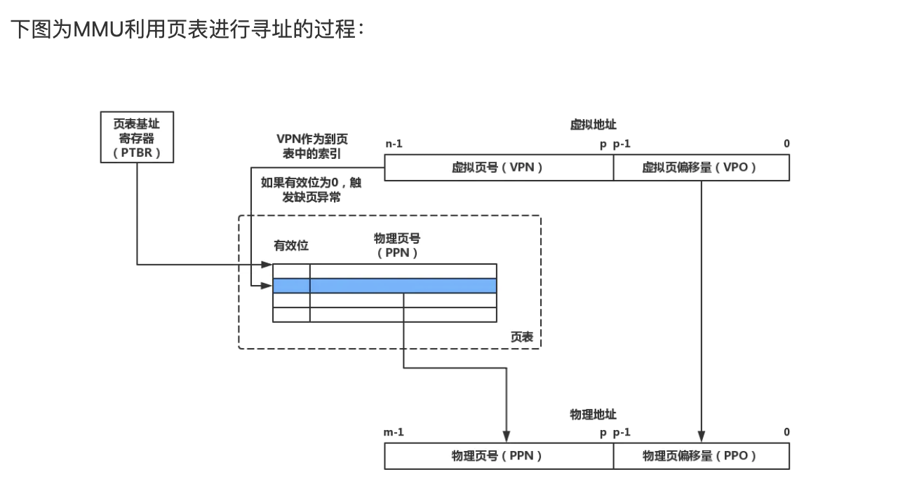
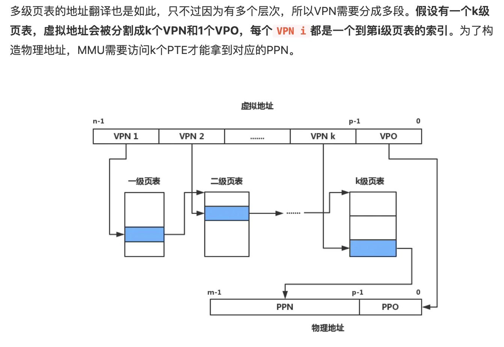

# Virtual Memory

**虚拟内存为每一个进程提供了一个一致的、私有的地址空间，它让每个进程产生了一种自己的独享主存的错觉（每个进程拥有一片连续完整的内存空间）**

虚拟内存主要提供了如下三个重要的能力：

- 它把主存看作为一个存储在硬盘上的虚拟地址空间的高速缓存，并且只在主存中缓存活动区域（按需缓存）。
- 它为每个进程提供了一个一致的地址空间，从而降低了程序员对内存管理的复杂性。
- 它还保护了每个进程的地址空间不会被其他进程破坏。

## CPU寻址

虚拟寻址需要hardware和os相互合作：CPU中含有一个被称为内存管理单元的硬件，它的功能是将虚拟地址转换为物理地址。MMU需要借助存放在内存中的也表来动态翻译虚拟地址，该页表由OS管理

## 页表

**操作系统通过将虚拟内存分割为大小固定的块来作为硬盘和内存之间的传输单位，这个块被称为虚拟页（Virtual Page, VP），每个虚拟页的大小为`P=2^p`字节。物理内存也会按照这种方法分割为物理页（Physical Page, PP），大小也为`P`字节。**

CPU在获得虚拟地址之后，需要通过MMU将虚拟地址翻译为物理地址。而在翻译的过程中还需要借助页表，所谓**页表就是一个存放在物理内存中的数据结构，它记录了虚拟页与物理页的映射关系。**

页表是一个元素为页表条目的集合，每个虚拟页在页表中一个固定偏移量的位置都有一个PTE

**虚拟内存跟CPU高速缓存（或其他使用缓存的技术）一样依赖于局部性原则**。虽然处理缺页消耗的性能很多（毕竟还是要从硬盘中读取），而且程序在运行过程中引用的不同虚拟页的总数可能会超出物理内存的大小，但是**局部性原则保证了在任意时刻，程序将趋向于在一个较小的活动页面（active page）集合上工作，这个集合被称为工作集（working set）**

空间局部性原则（一个被访问过的内存地址以及其周边的内存地址都会有很大几率被再次访问）与时间局部性原则（一个被访问过的内存地址在之后会有很大几率被再次访问）

**多级页表：**

如果一个一级页表的一个PTE是空的，那么相应的二级页表也不会存在。这代表一种巨大的潜在节约（对于一个普通的程序来说，虚拟地址空间的大部分都会是未分配的）。

只有一级页表才总是需要缓存在内存中的，这样虚拟内存系统就可以在需要时创建、页面调入或调出二级页表（只有经常使用的二级页表才会被缓存在内存中），这就减少了内存的压力。

## 地址翻译过程

**内存映射提供了共享对象的机制，来避免内存资源的浪费。一个对象被映射到虚拟内存的一个区域，要么是作为共享对象，要么是作为私有对象的。**

## 垃圾收集器

垃圾收集器一般采用以下两种（之一）的策略来判断一块堆内存是否为垃圾内存：

- 引用计数器：在数据的物理空间中添加一个计数器，当有其他数据与其相关时（引用），该计数器加一，反之则减一。通过定期检查计数器的值，只要为0则认为是垃圾内存，可以释放它所占用的已分配块。使用引用计数器，实现简单直接，但缺点也很明显，它无法回收循环引用的两个对象（假设有对象A与对象B，它们2个互相引用，但实际上对象A与对象B都已经是没用的对象了）。
- 可达性分析：垃圾收集器将堆内存视为一张有向图，然后选出一组根节点（例如，在Java中一般为类加载器、全局变量、运行时常量池中的引用类型变量等），根节点必须是足够“活跃“的对象。然后计算从根节点集合出发的可达路径，只要从根节点出发不可达的节点，都视为垃圾内存。

垃圾收集器进行回收的算法有如下几种：

- 标记-清除：该算法分为标记（mark）和清除（sweep）两个阶段。首先标记出所有需要回收的对象，然后在标记完成后统一回收所有被标记的对象。标记-清除算法实现简单，但它的效率不高，而且会产生许多内存碎片。
- 标记-整理：标记-整理与标记-清除算法基本一致，只不过后续步骤不是直接对可回收对象进行清理，而是让所有存活的对象都向一端移动，然后直接清理掉边界以外的内存。
- 复制：**将程序所拥有的内存空间划分为大小相等的两块，每次都只使用其中的一块。当这一块的内存用完了，就把还存活着的对象复制到另一块内存上，然后将已使用过的内存空间进行清理**。这种方法不必考虑内存碎片问题，但内存利用率很低。这个比例不是绝对的，像HotSpot虚拟机为了避免浪费，将内存划分为Eden空间与两个Survivor空间，每次都只使用Eden和其中一个Survivor。当回收时，将Eden和Survivor中还存活着的对象一次性地复制到另外一个Survivor空间上，然后清理掉Eden和刚才使用过的Survivor空间。HotSpot虚拟机默认的Eden和Survivor的大小比例为8：1，只有10%的内存空间会被闲置浪费。
- 分代：**分代算法根据对象的存活周期的不同将内存划分为多块，这样就可以对不同的年代采用不同的回收算法**。一般分为新生代与老年代，新生代存放的是存活率较低的对象，可以采用复制算法；老年代存放的是存活率较高的对象，如果使用复制算法，那么内存空间会不够用，所以必须使用标记-清除或标记-整理算法。

## summary

虚拟内存是对内存的一个抽象，支持虚拟内存的CPU需要通过虚拟寻址的方式来引用内存中的数据。CPU加载一个虚拟地址，然后发送给MMU进行地址翻译。地址翻译需要硬件与操作系统之间的紧密合作，MMU借助页表来获得物理地址。

- 首先，MMU先将虚拟地址发送给TLB以获得PTE（根据VPN寻址）。
- 如果恰好TLB中缓存了该PTE，那么就返回给MMU，否则MMU需要从高速缓存/内存中获得PTE，然后更新缓存到TLB。
- MMU获得了PTE，就可以从PTE中获得对应的PPN，然后结合VPO构造出物理地址。
- 如果在PTE中发现该虚拟页没有缓存在内存，那么会触发一个缺页异常。缺页异常处理程序会把虚拟页缓存进物理内存，并更新PTE。异常处理程序返回后，CPU会重新加载这个虚拟地址，并进行翻译。

虚拟内存系统简化了内存管理、链接、加载、代码和数据的共享以及访问权限的保护：

- 简化链接，独立的地址空间允许每个进程的内存映像使用相同的基本格式，而不管代码和数据实际存放在物理内存的何处。
- 简化加载，虚拟内存使向内存中加载可执行文件和共享对象文件变得更加容易。
- 简化共享，独立的地址空间为操作系统提供了一个管理用户进程和内核之间共享的一致机制。
- 访问权限保护，每个虚拟地址都要经过查询PTE的过程，在PTE中设定访问权限的标记位从而简化内存的权限保护。

操作系统通过将虚拟内存与文件系统结合的方式，来初始化虚拟内存区域，这个过程称为内存映射。应用程序显式分配内存的区域叫做堆，通过动态内存分配器来直接操作堆内存。