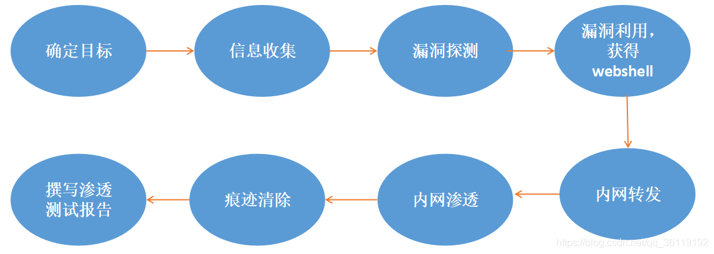

# 渗透测试的流程

## 定义

渗透测试就是利用我们所掌握的渗透知识，对网站进行一步一步的渗透，发现其中存在的漏洞和隐藏的风险，然后撰写一篇测试报告，提供给我们的客户。客户根据我们撰写的测试报告，对网站进行漏洞修补，以防止黑客的入侵！

渗透测试的前提是我们得经过用户的授权，才可以对网站进行渗透。如果我们没有经过客户的授权而对一个网站进行渗透测试的话，这是违法的。

模拟黑客对一个网站进行渗透测试，属于黑盒测试，只知道该网站的URL，其他什么的信息都不知道。

## 步骤流程

1. 信息收集
   1. 正所谓知己知彼百战百胜，我们根据网站URL可以查出一系列关于该网站的信息。通过URL我们可以查到该网站的IP、该网站操作系统、脚本语言、在该服务器上是否还有其他网站等等一些列的信息。
2. 漏洞探测
   1. 当我们收集到了足够多的信息之后，我们就要开始对网站进行漏洞探测了。探测网站是否存在一些常见的Web漏洞：
      1. SQL注入
      2. XSS跨站脚本
      3. CSRF跨站请求伪造
      4. XXE漏洞
      5. SSRF服务端请求伪造漏洞
      6. 文件包含漏洞
      7. 文件上传漏洞
      8. 文件解析漏洞
      9.  远程代码执行漏洞
      10. CORS跨域资源共享漏洞
      11. 越权访问漏洞
      12. 目录浏览漏洞和任意文件读取/下载漏洞
      13. struts漏洞
      14. Java反序列化漏
3. 漏洞利用
4. 内网转发
5. 内网渗透
6. 痕迹清除
7. 撰写渗透测试报告