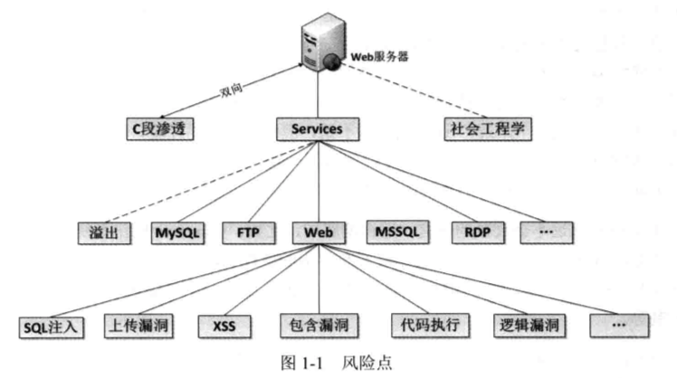
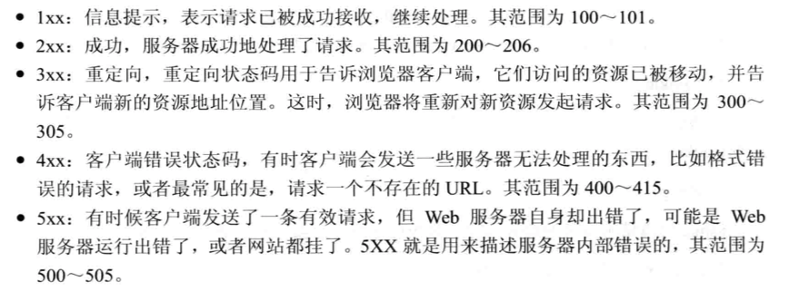
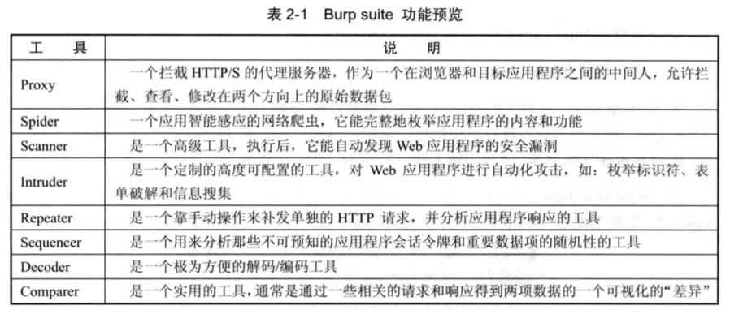
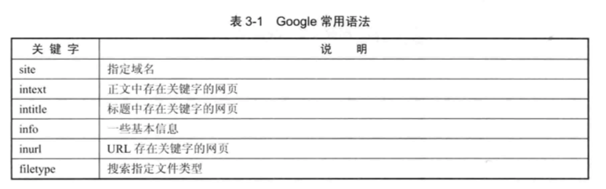
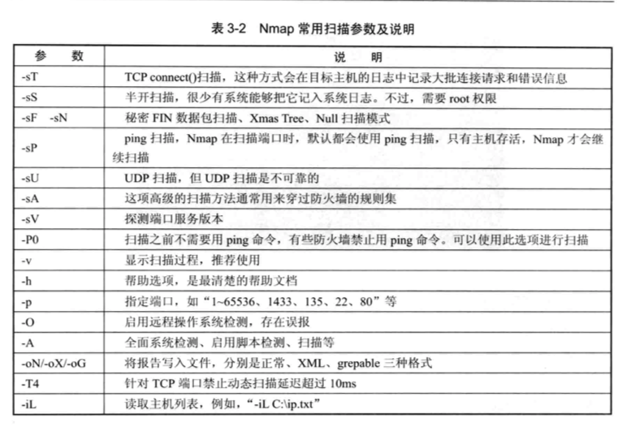
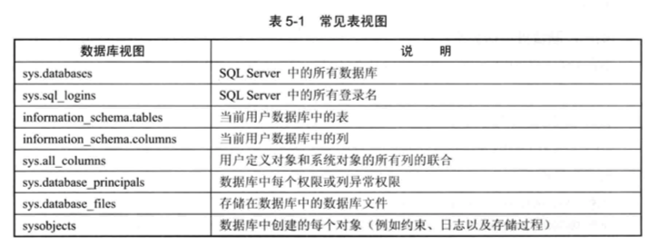

# Web Security Learning Notes

> Reference: [《Web安全深度剖析》](https://book.douban.com/subject/26348894/)

## Chapter 1 Web安全简介

1. 一个服务器的风险点：

- C段渗透：攻击者通过渗透同一网段内的一台主机对目标主机进行ARP等手段的渗透
- 社会工程学：16章详细介绍
- Services

## Chatper 2 深入HTTP请求流程

### 2.1 HTTP协议解析

1. 除了借助浏览器，还可以使用curl命令发起HTTP请求

2. HTTP是一种无状态的协议，无状态是指Web浏览器与Web服务器之间不需要建立持久的连接，服务器端不保留连接的有关信息，HTTP请求只能由客户端发起，而服务器端不能主动向客户端发送数据。

3. HTTP请求包括三部分：请求行（包括请求方法）、请求头和请求正文

4. HTTP响应也包括三部分：响应行、响应头和响应正文

5. HTTP请求方法：

   1. GET：用于获取请求页面的指定信息。如果请求资源为动态脚本，那么返回文本是web容器解析后的HTML源代码。服务端会选择接收请求中的参数，这是开发者内定好的，不会理会干扰项。
   2. HEAD：除了服务器不能再响应里返回消息主题外，其他和GET相同。一般用来：检测超文本链接有效性、可访问性和最近的改变。**扫描攻击工具常用这个方法：又快又好**
   3. POST：与GET像是，POST有请求内容，而且最多用于向服务器发送大量的数据，POST发送数据大小无限制，而且安全性高一些。
   4. PUT：用于请求服务器把请求中的实体存储再请求资源下。如果已经有，会替换，如果不存在则创建。**一般会关闭这个方法，比较危险**
   5. DELETE：用于请求服务器删除请求的指定资源。
   6. TRACE：用于激发一个远程的应用层的请求信息回路。
   7. CONNECT：用于动态切换到隧道的代理
   8. OPTIONS：用于请求获得由URI标识的资源再请求/响应的通信过程中可以使用的功能选项。

6. HTTP状态码：

   

   常见状态码：200-客户端请求成功、302-重定向、404-请求资源不存在、400-客户端请求语法错误，不能被服务器所理解、401-请求未经授权、403-服务器收到请求，但是拒绝提供服务、500-服务器内部错误、503-服务器当前不能处理客户端的请求

7. HTTP消息：

   - 请求头：HOST、User-Agent、Referer、Cookie、Range、x-forward-for：请求端IP、Accept、Accept-Charset
   - 响应头：Server、Set-Cookie、Last-Modified、Location、Refresh
   - 普通头：Date
   - 实体头：Content-Type、Content-Encoding、Content-Length、Last-Modified

8. HTTP和HTTPS：

   1. HTTP是明文传输，HTTPS是具有安全性的SSL加密传输协议
   2. HTTP和HTTPS使用的是完全不同的连接方式，前者采用80端口连接，后者是443端口
   3. HTTPS需要到CA申请证书

### 2.2 截取HTTP请求

1. Burp Suite功能模块 

## Chapter 3 信息探测

1. Google hack

   

2. Nmap：扫描计算机开发的网络连接端，确定哪些服务运行在哪些连接端，并且推断计算机运行哪个操作系统。另外，它也用于评估网络系统安全。

   

除此之外，还可以使用namp script来快速探测服务器，可以参考:http://nmap.org/nsedoc/

3. DirBuster

   是一款专门用于探测Web服务器的目录和隐藏文件。类似的扫描工具还有很多。针对目录扫描的时候，需要递归进行测试。

4. 指纹识别

   计算机的指纹识别不仅针对网站CMS的指纹识别，还有针对服务器操作系统的指纹识别和对Web容器的指纹识别等。

## Chapter 4 漏洞扫描

学会使用burp suite（无敌神器）

## Chpater 5 SQL注入漏洞

注入漏洞分类：数字型和字符型。

常见注入：

- POST注入
- Cookie注入
- 延时注入
- 搜索注入
- base64注入

常见数据库的注入：

- SQL Server
  - 利用错误消息来提取：SQL Server准确定位错误信息，good for attacker
  - 获取元数据：提供大量视图，比如使用informatuon_schema.tables的视图。

  
  
  - order by子句：
  - union
  
- Oracle

- MySQL

利用方式：查询数据、读写文件、执行命令

