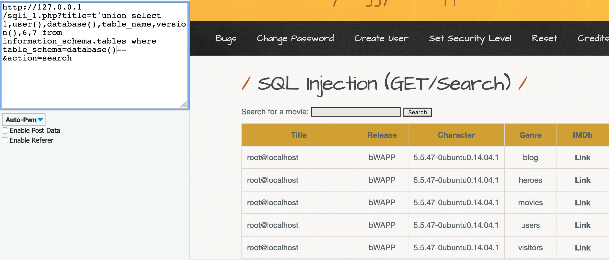
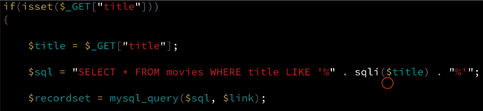
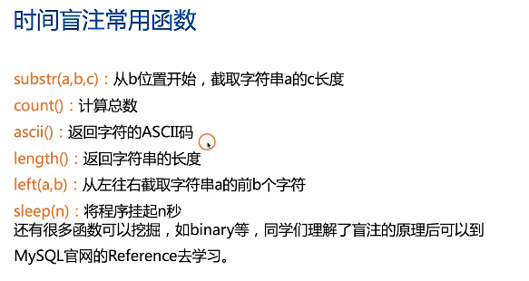
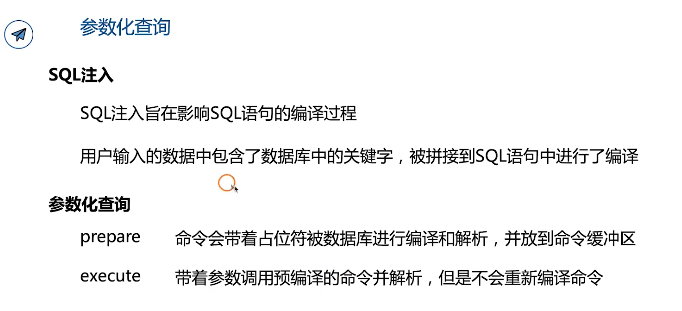
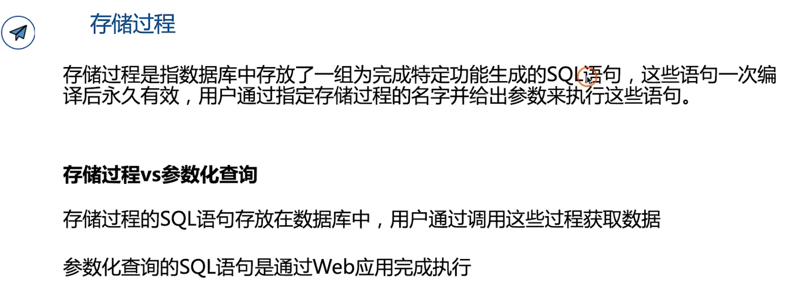
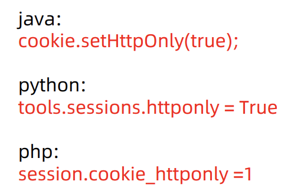
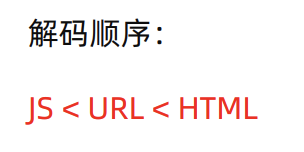

# GeekBang course - Web Security

> refrence: [SQL注入的一些学习](https://www.cnblogs.com/0x7e/p/13748715.html)

## Web安全之后端安全

### 文件上传漏洞

- 文件上传漏洞：上传可以在服务端执行的webshell等，例如php的一行木马代码：`?php @eval($_POST['hacker']); ?>`，然后使用post命令，将hacker字段设计成恶意代码post上去，eval命令执行恶意代码，实现攻击。

- 集成型的webshell工具：[中国菜刀](https://github.com/raddyfiy/caidao-official-version):可以用于测试，但是只有windows版。

- 当实际生活中遇到限定上传文件类型的时候，可以查看服务器配置文件内对各种文件处理的配置，通过其配置文件中的规则找到绕过的方法。例如：当网站禁止上传php后缀的文件后，你可以先查看php配置文件中对文件后缀的处理，可以修改为php3、php4、php5等上传到网站上，成功上传即完成绕过。

- 中阶：

  - 前端绕过
  - Content-Type绕过
  - 大小写绕过：根据系统来，windows大小写不敏感，linux大小写敏感
  - windows文件流特征性绕过
  - 截断绕过

- 代码审计：1）代码逻辑安全性 2）调用函数的安全性

- 漏洞链

- Fuzz模糊测试：

  在生产环境时不推荐使用，多用于非生产环境，它会生成大量异常输入，如果没有人工分析的话，可能造成生产环境崩溃。还有可能会产生大量负载，可能会对生产环境造成影响。安全检测过程中很容易由于过多访问触发安全警报，进而为后续安全检测制造障碍。

- 防御措施：
  - 文件类型检测：白名单优于黑名单
  - 使用安全的函数进行编程
  - 熟悉业务部署环境的OS、Web Server配置

### SQL注入

- 原理：发生在应用程序和数据库层的安全漏洞，主要出现在用户输入恶意SQL代码，Web应用又未对动态构造的SQL语句使用的参数进行审查时。

- GET型的SQL漏洞

  提交网页内容的时候，主要分为GET方法，POST方法，GET方法提交的内容会显示在网页URL上，通过对URL连接进行构造，可以获得超出权限的信息内容。

- > Web程序的三层架构
  >
  > 界面层 + 业务逻辑层 + 数据访问层
  >
  >  用户访问网页实际经过的流程：
  >
  > web浏览器输入的网址链接到目标服务器->业务逻辑层的web服务器从本地存储加载index.php脚本并解析->脚本连接位于数据访问层的DBMS，并执行SQL->数据访问层的DBMS返回SQL的执行结果给web server->业务逻辑层的web server将页面封装成HTML格式发送给表示层的浏览器->表示层的浏览器解析HTML并将内容呈现给用户。
  
- 危险：

  - 猜解后台数据库，盗取网址敏感信息
  - 绕过验证登入网址后台
  - 借助数据库的 存储过程进行提取等操作

- 实战：

  - UNION的作用：
  - 
  -  information_schema数据库中保存着所有数据库和表结构信息。
  
- POST注入

  - 定义&原理：
    - 在HTTP常用方法中，POST方法提交的信息不存储与URL，而是存储在HTTP实体内容中，在大多的提交过程中，用户是无感知的。
    - 且注入信息是存储于HTTP实体内容中而不是URL，通过改造实体内容，达到实际执行的SQL语句获取更多信息的目的。
  - [group_concat()](https://blog.csdn.net/weixin_43997530/article/details/105627979?utm_medium=distribute.pc_relevant_t0.none-task-blog-BlogCommendFromMachineLearnPai2-1.channel_param&depth_1-utm_source=distribute.pc_relevant_t0.none-task-blog-BlogCommendFromMachineLearnPai2-1.channel_param) 这个函数可以将一列拼接成一个字符串.

- 判断SQL注入点

  - 需要考虑的两个点

    - 判断该访问目标URL是否存在SQL注入？
    - 如果存在SQL注入，那么属于哪种SQL注入？

  - 经典的单引号判断法

    - 如果页面返回错误，则存在SQL注入，原因是无论字符型还是整型都会因为单引号个数不匹配而报错。

  - 判断注入类型：

    - 数字型

      通常语句类型为select * from <表名> where id = x

      我们通常构造and 1=1以及an 1=2 来判断

    - 字符型

      通常语句类型为select * from <表名> where id = 'x'

      我们通常构造and '1'='1以及an '1'='2 来判断
    
    

- SQL注入类型

  - Bool型注入

  - 可联合查询注入 

  - 基于时间延迟注入

    - 通过注入特定语句，根据对页面请求的物理反馈，来判断是否注入成功，如：在SQL语句红使用sleep()函数看加载网页的时间来判断注入点。

    - 适用场景：通常是无法从显示页面上获取执行结果，甚至连注入语句是否执行都无从得知。
    - 

  - 报错型注入

  - 可多语句查询注入

- HTTP头注入

  - 针对HTTP的请求头，如果不加以过滤或者转义，在直接与数据库交互的过程中容易被利用进行SQL注入攻击，即HTTP头注入。

    - 常见场景：访问Web server时，web server会从HTTP Header中取出浏览器信息、IP地址、HOST信息等存储到数据库中。

  - 作业：

    - SQL注入：

      我们在课程中已经知道数据库名称为bWAPP，注意每一次只能返回一行，所以要用limit 1

      1. information_schema.tables为数据库中表数据信息

         `111', (select table_name from information_schema.tables where table_schema=database() limit 1 offset 0)); #`

         这样可以成功查询数据表，调整offset偏移量控制返回的条数，可以发现offset为3时候，返回的是数据库表名为users，即我们所想查的表

      2. 查询user中包含的几个字段

         infomation_schema.columns很重要，查询数据库中行数据信息

         `111', (select column_name from information_schema.columns where table_name='users' limit 1 offset 2)); #`

         利用上面的指令，修改offser偏移量，可以获得id, login, password分别位于偏移0，1，2处。

      3. 查询具体敏感数据

         `111', (select password from users limit 1 offset 1)); #`

         直接对users数据表的第一个id字段进行查询，然后查询password 和 login，换上offset即可，重复上面的操作既可以完成SQL注入攻击。

    - 两种以上不同函数完成

      因为可以直接执行整句逻辑，很自由，下面两种方法都可以帮助我们进行SQL注入

      1. 布尔注入

         substring(version(),1,5) = 'bWAPP' 时返回 0 意味着我们还可以使用布尔进行SQL注入,需要编写简本

         `111', substring(database(),1,5)='bWAPP'); #`

      2. 时间延迟注入

         sleep(3) 与布尔型同理,但是可以应对没有回显情况.通过判断延时是否被执行从而推断出SQL条件是否正确.因为时间延迟注入中要前置条件为真,所以可以看作布尔注入升级版

         `111', substring(database(),1,1)='b' and sleep(2)); #`

- 报错注入：

  - 参考：[报错注入原理分析以及python写报错注入](https://blog.csdn.net/m0_46304840/article/details/104733922)

- 堆叠注入：一堆SQL语句一起执行

- 用户和组

- webshell就是以asp、php、jsp或者cgi等网页文件形式存在的一种代码执行环境，也可以将其称为一种网页后门。

  - 攻击者在入侵了一个网站后，通常会将asp或者php后门文件与网站服务器web目录下的正常的网页文件混在一起，然后就可以使用浏览器来访问asp或者php后门，得到一个命令执行环境，以达到控制网站服务器的目的。
  - 作用：
    - 维持远程访问：一句话木马
    - 权限提升
    - 发动网络攻击
  - 免杀：定义函数、
  - 隐藏webshell

- nosql防御措施：
  - 对输入的进行检查
  - waf
  - 编码时注意一下

- 防御

  - 形成原因：用户输入的数据作为代码执行

  - 预处理方式：

    - 参数化查询：
    - 
    - 存储过程：放在mysql.proc中

    

    - 白名单：直接收白名单中规定内容的

## Web安全之前端安全

### XSS

浏览器将用户输入的内容，当作脚本执行，执行了恶意的功能，这种针对用户浏览器的攻击即跨站脚本攻击

主要分为三类：

- 反射型
- 存储型
- DOM型

危害：

- 盗取cookie
- 盗取账户
- 恶意软件下载
- 键盘记录
- 广告引流等等js能够写出的恶意功能

1. 反射型XSS

应用程序或 API 包括未经验证和未经转义的用户输入， 直接作为 HTML 输 出的一部分。一个成功的攻击可以让攻击者在受害者的浏览器中执行任意 的 HTML 和 JavaScript 。

特点：非持久化，必须用户点击带有特定参数的链接才能引起影响范围：仅执行脚本的用户

- 防御措施：

  对陌生的链接，不要随意点开。

2. 存储型XSS

存储型 XSS 是指应用程序通过 Web 请求获取不可信赖的数据，在未检验 数据是否存在 XSS 代码的情况下，便将其存入数据库。当下一次从数据库 中获取该数据时程序也未对其进行过滤，页面再次执行 XSS 代码，存储型 XSS 可以持续攻击用户。

- 出现位置：
  - 留言板
  - 评论起
  - 用户头像
  - 个性签名
  - 博客

- 针对xss防御

  - 对用户的输入进行合理验证，对特殊字符（如<、>、’、”等）以及 <script>、 javascript 等进行过滤。
  - 使用html实体编码
  - 设置httponly属性，避免攻击者利用跨站脚本漏洞进行 Cookie 劫持攻击。在 Java EE 中，给 Cookie 添加 HttpOnly 的代码：

  

3. DOM型的XSS

- DOM

  DOM 模型用一个逻辑树来表示一个文档，每个分支 的终点都是一个节点 （node），每个节点都包含着 对象（objects）。DOM 的方法（methods）让你可 以用特定方式操作这个树，用这些方法你可以改变文 档的结构、样式或者内容。

- DOM型的XSS漏洞

  DOM 型 XSS 其实是一种特殊类型的反射型 XSS，通过 JS 操作 DOM 树动态地 输出数据到页面，而不依赖于将数据提交给服务器端，它是基于 DOM 文档对象 模型的一种漏洞。

- 与反射型的异同点和危害

  - 同：都是没有控制好输入，并且把 javaScript 脚本 输入作为输出插入到 HTML 页面
  - 异：反射型 XSS 是经过后端语言后，页面引用后端输出生效。DOM XSS 是经过 JS 对 DOM 树直接操作后插入到页面。
  - 危害性：前后端分离，不经过WAF的检测。

4. mXSS：攻击者输入看似安全的内容，在解析标记时经过浏览器重 写或者修改，发生突变，生成不安全的代码并执行，即 mXSS，极难被检测和过滤。

### 伪协议

伪协议不同于因特网上所广泛使用的如 http://,https://,ftp://，在 URL 中使用，用于执行特 定的功能：

4. XSS蠕虫

一种跨站脚本病毒，大多使用 JavaScript 脚本编写，突破浏览器的安全限制，XSS 蠕虫基于社会工程学诱使用户点击访问其发出的恶意邀请 链接在网站上感染访问网站的用户，受感染的用户发送含有蠕虫的内容， 再感染安全的用户。

